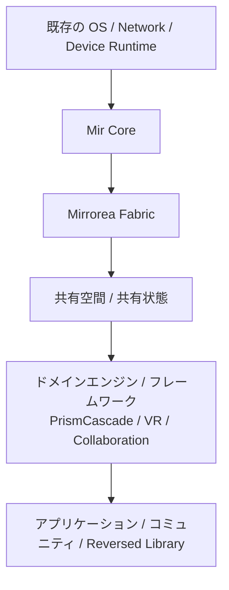
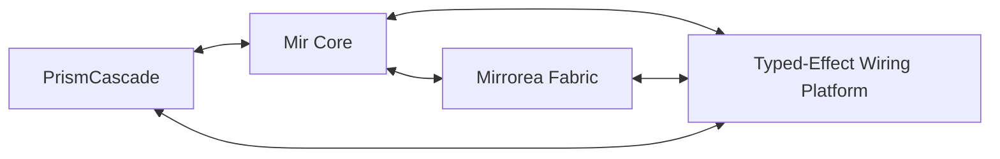

# ドキュメント要約

## リポジトリの目的

このリポジトリは、次のシステム群を中心とした**仕様先行の出発点**である。

- **Mir** — 意味論コア言語
- **Mirrorea** — 分散 fabric と制御プレーン（control plane）
- **PrismCascade** — メディアグラフ kernel
- **Typed-Effect Wiring Platform** — inspectable・routable・contract-aware な effect 層

## 現在の状態

- プロジェクトは**実装前段階 / アーキテクチャ重視段階**にある。
- 最も強い設計上の焦点は、意味論、境界、不変条件、統合点にある。
- いくつかの実装 skeleton は、将来の作業整理をしやすくするためだけに存在している。
- current L2 については、parser-free PoC 基盤と helper stack がかなり進んでおり、長期参照用の repository memory は `plan/` に整理している。

## Decision level 要約

- **L0（基盤）**
  - 因果は event graph / directed acyclic graph で表現される。
  - effect と contract は first-class である。
  - ownership / lifetime は後付けではなく本質的である。
  - 安全な進化は運用上の付随物ではなく設計目標である。
- **L1（強い方向性）**
  - Mir、Mirrorea、PrismCascade、Typed-Effect Wiring Platform は分離しつつ相互運用可能に保つ。
  - downstream addition と compatibility-preserving overlay を優先する。
- **L2（設計提案）**
  - Prism と Mir の正確な境界詳細
  - fallback / preference chains の完全意味論
  - 一部の concurrency / coroutine 詳細
- **L3（探索段階）**
  - Reversed Library の知識分類戦略
  - GUI プログラミング基盤
  - 一部の高度な patching / visualization の論点

## 図

`docs/diagrams/` を参照。

## 次にどこから読むか

1. `specs/00-document-map.md`
2. 次に `specs/01-charter-and-decision-levels.md`
3. 次に `specs/02-system-overview.md`
4. 次に `specs/03-layer-model.md` と `specs/09-invariants-and-constraints.md`
5. current repo の現況、roadmap、helper stack、PoC 境界を早く掴みたいときは `plan/00-index.md`
6. その後、必要な subsystem に進む
7. representative code で current L2 の書き味を確認したいときは `specs/examples/00-representative-mir-programs.md`
8. その examples で使う `perform`、option chain 参照、`try` / `fallback`、`require` / `ensure` clause、separator / block nesting の候補書式は `specs/examples/01-current-l2-surface-syntax-candidates.md`
9. parser なしで representative examples を machine-readable に扱う最小 AST fixture schema は `specs/examples/02-current-l2-ast-fixture-schema.md`、fixture 実体は `crates/mir-ast/tests/fixtures/current-l2/`
10. parser なし最小 interpreter に必要な evaluation state schema は `specs/examples/03-current-l2-evaluation-state-schema.md`
11. parser なし最小 interpreter の 1-step semantics は `specs/examples/04-current-l2-step-semantics.md`
12. parser なし最小 interpreter の predicate / effect oracle API は `specs/examples/05-current-l2-oracle-api.md`
13. parser なし最小 interpreter skeleton の実装境界は `specs/examples/06-current-l2-interpreter-skeleton.md`
14. current L2 host stub / fixture runner harness の最小境界は `specs/examples/07-current-l2-host-stub-harness.md`
15. current L2 host harness が読む machine-readable host plan schema と `.host-plan.json` sidecar 方針は `specs/examples/08-current-l2-host-plan-schema.md`
16. current L2 fixture と sidecar を 1 組として扱う bundle loader / bundle-level helper は `specs/examples/09-current-l2-bundle-loader.md`
17. current L2 fixture directory を bundle 群として一括実行する batch runner は `specs/examples/10-current-l2-batch-runner.md`
18. current L2 batch runner の上に薄く載る bundle selection helper は `specs/examples/11-current-l2-selection-helper.md`
19. current L2 selection helper の primitive mode を組み合わせる profile helper は `specs/examples/12-current-l2-selection-profiles.md`
20. current L2 selection profile helper の上に薄く載る small named profile catalog は `specs/examples/13-current-l2-profile-catalog.md`
21. current L2 named profile catalog を hard-coded table に留めるか、machine-readable asset として比較する整理は `specs/examples/14-current-l2-profile-catalog-externalization.md`
22. fallback / `lease` の semantic reconciliation と compact syntax candidate comparison は `specs/examples/15-current-l2-fallback-reconciliation-and-compact-syntax.md`
23. current L2 detached trace / audit artifact の docs-only minimal schema と exact-compare core / explanation の境界は `specs/examples/16-current-l2-detached-trace-audit-artifact-schema.md`
24. helper stack、roadmap、未決事項、representative fixture catalog を長期参照するには `plan/07-parser-free-poc-stack.md`、`plan/08-representative-programs-and-fixtures.md`、`plan/09-helper-stack-and-responsibility-map.md`、`plan/10-roadmap-overall.md`、`plan/12-open-problems-and-risks.md`
25. 既存判断は `specs/12-decision-register.md` を参照する

## レポート

すべての non-trivial work は、`docs/reports/` 配下に新しいファイルを生成しなければならない。

## 現在の環境メモ

この scaffold は、Python は利用できるが `cargo` は利用できない環境で作成された。
Rust workspace skeleton は存在するが、コンパイル可能性の検証は Rust が使えるマシンで別途行う必要がある。
