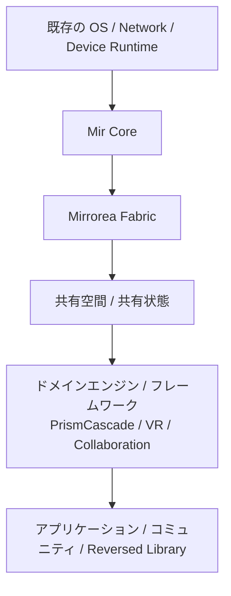
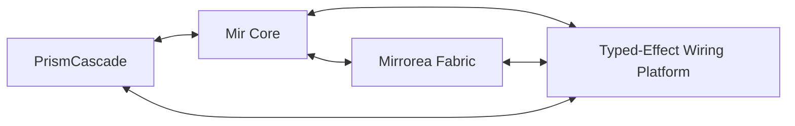

# ドキュメント要約

## リポジトリの目的

このリポジトリは、次のシステム群を中心とした**仕様先行の出発点**である。

- **Mir** — 意味論コア言語
- **Mirrorea** — 分散 fabric と制御プレーン（control plane）
- **PrismCascade** — メディアグラフ kernel
- **Typed-Effect Wiring Platform** — inspectable・routable・contract-aware な effect 層

## 現在の状態

- プロジェクトは**実装前段階 / アーキテクチャ重視段階**にある。
- 最も強い設計上の焦点は、意味論、境界、不変条件、統合点にある。
- いくつかの実装 skeleton は、将来の作業整理をしやすくするためだけに存在している。
- current L2 については、parser-free PoC 基盤と helper stack がかなり進んでおり、bundle / aggregate / static gate を含む detached validation loop の non-production 入口まで到達している。長期参照用の repository memory は `plan/` に整理している。

## Decision level 要約

- **L0（基盤）**
  - 因果は event graph / directed acyclic graph で表現される。
  - effect と contract は first-class である。
  - ownership / lifetime は後付けではなく本質的である。
  - 安全な進化は運用上の付随物ではなく設計目標である。
- **L1（強い方向性）**
  - Mir、Mirrorea、PrismCascade、Typed-Effect Wiring Platform は分離しつつ相互運用可能に保つ。
  - downstream addition と compatibility-preserving overlay を優先する。
- **L2（設計提案）**
  - Prism と Mir の正確な境界詳細
  - fallback / preference chains の完全意味論
  - 一部の concurrency / coroutine 詳細
- **L3（探索段階）**
  - Reversed Library の知識分類戦略
  - GUI プログラミング基盤
  - 一部の高度な patching / visualization の論点

## 図

`docs/diagrams/` を参照。

## 次にどこから読むか

1. `specs/00-document-map.md`
2. 次に `specs/01-charter-and-decision-levels.md`
3. 次に `specs/02-system-overview.md`
4. 次に `specs/03-layer-model.md` と `specs/09-invariants-and-constraints.md`
5. current repo の現況、roadmap、helper stack、PoC 境界を早く掴みたいときは `plan/00-index.md`
6. 直近の概算進捗、残課題、validation loop までの rough step estimate を先に見たいときは `progress.md`
7. repo 全体の研究 phase、現在位置、重さ、自走可否を見たいときは `plan/17-research-phases-and-autonomy-gates.md`
8. その後、必要な subsystem に進む
9. representative code で current L2 の書き味を確認したいときは `specs/examples/00-representative-mir-programs.md`
10. その examples で使う `perform`、option chain 参照、`try` / `fallback`、`require` / `ensure` clause、separator / block nesting の候補書式は `specs/examples/01-current-l2-surface-syntax-candidates.md`
10. parser なしで representative examples を machine-readable に扱う最小 AST fixture schema は `specs/examples/02-current-l2-ast-fixture-schema.md`、fixture 実体は `crates/mir-ast/tests/fixtures/current-l2/`
11. parser なし最小 interpreter に必要な evaluation state schema は `specs/examples/03-current-l2-evaluation-state-schema.md`
12. parser なし最小 interpreter の 1-step semantics は `specs/examples/04-current-l2-step-semantics.md`
13. parser なし最小 interpreter の predicate / effect oracle API は `specs/examples/05-current-l2-oracle-api.md`
14. parser なし最小 interpreter skeleton の実装境界は `specs/examples/06-current-l2-interpreter-skeleton.md`
15. current L2 host stub / fixture runner harness の最小境界は `specs/examples/07-current-l2-host-stub-harness.md`
16. current L2 host harness が読む machine-readable host plan schema と `.host-plan.json` sidecar 方針は `specs/examples/08-current-l2-host-plan-schema.md`
17. current L2 fixture と sidecar を 1 組として扱う bundle loader / bundle-level helper は `specs/examples/09-current-l2-bundle-loader.md`
18. current L2 fixture directory を bundle 群として一括実行する batch runner は `specs/examples/10-current-l2-batch-runner.md`
19. current L2 batch runner の上に薄く載る bundle selection helper は `specs/examples/11-current-l2-selection-helper.md`
20. current L2 selection helper の primitive mode を組み合わせる profile helper は `specs/examples/12-current-l2-selection-profiles.md`
21. current L2 selection profile helper の上に薄く載る small named profile catalog は `specs/examples/13-current-l2-profile-catalog.md`
22. current L2 named profile catalog を hard-coded table に留めるか、machine-readable asset として比較する整理は `specs/examples/14-current-l2-profile-catalog-externalization.md`
23. fallback / `lease` の semantic reconciliation と compact syntax candidate comparison は `specs/examples/15-current-l2-fallback-reconciliation-and-compact-syntax.md`
24. current L2 detached trace / audit artifact の docs-only minimal schema と exact-compare core / explanation の境界は `specs/examples/16-current-l2-detached-trace-audit-artifact-schema.md`
25. detached artifact exporter を narrow に始めるなら `RunReport` / `BundleRunReport` / `BatchRunSummary` のどこを entry に切るべきか、という comparison は `specs/examples/17-current-l2-detached-exporter-entry-comparison.md`
26. bundle-first detached exporter で `RunReport` payload core と `FixtureBundle` context をどう分け、`host_plan_coverage_failure` をどこに残すか、という docs-only split は `specs/examples/18-current-l2-bundle-first-detached-payload-context-split.md`
27. `host_plan_coverage_failure` を current detached artifact では aggregate-only に残しつつ、将来 typed carrier に昇格させるならどの layer が自然か、という比較は `specs/examples/19-current-l2-host-plan-coverage-failure-placement.md`
28. `host_plan_coverage_failure` を将来 bundle failure artifact 側の typed carrier に昇格させるなら、その最小 schema をどう切るかの docs-only refinement は `specs/examples/20-current-l2-host-plan-coverage-failure-bundle-failure-artifact-schema.md`
29. bundle failure artifact 側の `failure.failure_kind` discriminator-only schema を `BatchRunSummary` aggregate export がどこまで typed に吸うべきか、という narrow comparison は `specs/examples/21-current-l2-host-plan-coverage-failure-aggregate-connection.md`
30. aggregate export 側に typed histogram / kind count を入れるなら、その field 名と migration cut をどう切るかの docs-only refinement は `specs/examples/22-current-l2-host-plan-coverage-failure-aggregate-histogram-migration.md`
31. detached exporter chain の current docs-only judgment、bundle-first loop attachment、typed failure / aggregate migration の統合 view は `specs/examples/23-current-l2-detached-export-loop-consolidation.md`
32. detached validation loop を回すときの aggregate export 接続、artifact 保存先 / path policy、file naming / overwrite policy、compare input discovery の最小 cut は `specs/examples/24-current-l2-detached-export-storage-and-aggregate-api.md`
33. detached validation loop の aggregate 側 actual narrow cut、`bundle_failure_kind_counts` と current list anchor の coexistence、aggregate emitter sketch は `specs/examples/25-current-l2-detached-aggregate-emitter-sketch.md`
34. detached validation loop の aggregate compare contract と `compare-aggregates` wrapper の最小 cut は `specs/examples/26-current-l2-detached-aggregate-compare-helper.md`
35. fixture authoring の boilerplate だけを `target/` 下へ切り出す non-production scaffold helper の最小 cut は `specs/examples/27-current-l2-fixture-scaffold-helper.md`
36. detached validation loop で 1 fixture を bundle emit / optional reference compare / single-fixture aggregate smoke まで 1 command で回す non-production helper 境界は `specs/examples/28-current-l2-detached-fixture-validation-loop-helper.md`
37. final grammar を固定する前に、first parser cut に入れてよい semantic cluster と companion notation に残す cluster を narrow に棚卸しする inventory は `specs/examples/29-current-l2-first-parser-subset-inventory.md`
38. first parser cut inventory の次段として、current L2 で core checker に入れてよい local / structural judgment と theorem prover / model checker へ残す judgment の切り分けは `specs/examples/30-current-l2-first-checker-cut-entry-criteria.md`
39. first parser cut inventory を actual parser spike へ送る順序として、chain / declaration structural floor → `try` / rollback structural floor → request / admissibility cluster の checker-led staged spike が current next narrow step である、という sequencing judgment は `specs/examples/73-current-l2-first-parser-spike-staging.md`
40. その stage 1 を actual parser spike として切るなら、option declaration core / explicit edge-row family / edge-local lineage metadata / declaration-side guard slot を structural floor に限って受け、guard fragment 自体の parse は later stage に残す current judgment は `specs/examples/74-current-l2-stage1-parser-spike-entry-criteria.md`
41. stage 1 の declaration-side guard slot を actual parser / checker handoff へ送るときは、parser-side opaque slot carrier を持ちつつ current parser-free AST fixture schema の `OptionDecl.lease` へ narrow lowering するのが自然だという current judgment は `specs/examples/75-current-l2-stage1-parser-guard-slot-handoff.md`
42. その handoff で parser-side opaque slot carrier の naming と thin lowering bridge の private API surface を narrow に決めるなら、`decl_guard_slot` を第一候補とし、bridge は slot-only ではなく option-level structural transfer として読むのが自然だという current judgment は `specs/examples/76-current-l2-stage1-parser-opaque-slot-carrier-and-bridge-api.md`
43. actual parser spike の stage 1 smoke family をどこまで narrow に始めるかについては、`e4-malformed-lineage` と `e7-write-fallback-after-expiry` の two-fixture pair を最小 working set にし、`e3-option-admit-chain` は later-stage contrast reference に残すのが自然だという current judgment は `specs/examples/77-current-l2-stage1-parser-smoke-family-working-set.md`
44. actual stage 1 parser spike を actualize するなら、private helper は `crates/mir-ast/tests/support/` に置き、compare surface は parser-side raw AST ではなく lowered fixture-subset compare に留めるのが自然だという current judgment は `specs/examples/78-current-l2-stage1-parser-spike-placement-and-compare-surface.md`
45. detached validation loop の aggregate 側 actual narrow cut を example private transform から repo 内 callable boundary へ落とす shared support helper は `specs/examples/31-current-l2-detached-aggregate-transform-helper.md`
46. first checker cut の local / structural floor を static-only / malformed / underdeclared fixture の detached compare loop に接続する最小 helper cut は `specs/examples/32-current-l2-static-gate-artifact-loop.md`
47. `expected_static.reasons` の dual-use を explanation と machine-check carrier に分ける additive optional cut は `specs/examples/33-current-l2-checked-static-reasons-carrier.md`
48. `checked_reasons` から typed reason code へ進める条件と stable cluster inventory は `specs/examples/34-current-l2-static-reason-code-entry-criteria.md`
49. detached static gate artifact の helper-local / reference-only `reason_codes` mirror は `specs/examples/35-current-l2-detached-static-reason-code-mirror.md`
50. `expected_static.checked_reasons` を narrow に採用するときの display-only assist と、fixture JSON を auto-fill しない current cut は `specs/examples/36-current-l2-checked-reasons-authoring-assist.md`
51. bundle-first detached artifact の private transform を example private code から repo 内 callable boundary へ落とす shared support helper は `specs/examples/37-current-l2-detached-bundle-transform-helper.md`
52. detached static gate artifact の helper-local / reference-only `reason_codes` を future typed carrier 候補 row として display-only 表示する assist は `specs/examples/38-current-l2-static-reason-codes-authoring-assist.md`
53. static-only fixture corpus を横断し、`checked_reasons` adoption と detached static gate artifact の `reason_codes` suggestion availability を display-only に要約する readiness scan は `specs/examples/39-current-l2-static-reason-code-readiness-scan.md`
54. future typed static reason carrier をどの stable family から narrow に actualize し始めるかの first selection は `specs/examples/40-current-l2-first-typed-static-reason-family-selection.md`
55. first selected family をどの carrier へ first-class に置くか、という placement と actualization cut は `specs/examples/41-current-l2-first-typed-static-reason-family-carrier-cut.md`
56. second tranche として declared target edge pair family を同じ fixture-side additive carrier に広げる cut は `specs/examples/42-current-l2-second-typed-static-reason-family-actualization.md`
57. current stable cluster inventory の remaining tranche を `checked_reason_codes` へ揃え、duplicate cluster だけを非昇格に残す cut は `specs/examples/43-current-l2-complete-stable-static-reason-tranche.md`
58. `checked_reasons` と `checked_reason_codes` の additive coexistence を維持し、shrink 条件を docs-first に比較する cut は `specs/examples/44-current-l2-checked-reasons-coexistence-and-shrink-policy.md`
59. current static-only corpus が first checker cut の local / structural floor をどこまで覆っているかの baseline は `specs/examples/45-current-l2-first-checker-cut-regression-baseline.md`
60. first checker cut の actual first spike として same-lineage static evidence floor を helper-local に切り出す最小 cut は `specs/examples/46-current-l2-same-lineage-first-checker-spike.md`
61. same-lineage first checker spike の次段として missing-option structure floor を helper-local に切り出す最小 cut は `specs/examples/47-current-l2-missing-option-second-checker-spike.md`
62. missing-option second checker spike の次段として capability strengthening floor を helper-local に切り出す最小 cut は `specs/examples/48-current-l2-capability-third-checker-spike.md`
63. 3 family checker spike の duplicated compare contract を shared support helper へ薄く寄せ、family facade script は残す current cut は `specs/examples/49-current-l2-shared-family-checker-support-helper.md`
64. shared support helper 導入後も family facade script を維持し、generic checker-side shared entry はまだ切らない current judgment は `specs/examples/50-current-l2-generic-family-checker-entry-comparison.md`
65. `TryFallback` / `AtomicCut` の structural floor と、`place_anchor == current_place` gate / whole-store restore scope を runtime / proof boundary に残す current judgment は `specs/examples/51-current-l2-try-rollback-structural-floor-and-restore-scope.md`
66. `TryFallback` / `AtomicCut` の structural floor は current phase では fourth checker spike に actualize せず、docs/runtime representative に留める comparison judgment は `specs/examples/52-current-l2-try-rollback-fourth-checker-spike-comparison.md`
67. `TryFallback` / `AtomicCut` を将来 dedicated AST structural helper に actualize するなら、parser/loader malformed source、AST-only floor、reason-row family と分ける dedicated carrier、runtime gate 非依存という最小 entry criteria を先に満たすべきだという current docs-only judgment は `specs/examples/53-current-l2-try-rollback-ast-structural-helper-entry-criteria.md`
68. `TryFallback` / `AtomicCut` の structural malformed source は current parser-free phase では parser でも loader でもなく static gate / dedicated AST structural helper 側へ置き、loader は carrier/schema malformed に留めるべきだという current docs-only judgment は `specs/examples/54-current-l2-try-rollback-structural-malformed-source-placement.md`
69. `TryFallback` / `AtomicCut` の malformed static family は current phase ではまだ actual corpus に増やさず、runtime representative `E2` / `E21` / `E22` を current evidence として維持するのが自然だという current docs-only judgment は `specs/examples/55-current-l2-try-rollback-malformed-static-family-actualization.md`
70. future dedicated AST structural helper を切る場合の compare contract は、current phase では row-family 流用や detached artifact shared carrier 先行ではなく、helper-local dedicated contract から始めるのが自然だという current docs-only judgment は `specs/examples/56-current-l2-try-rollback-ast-helper-compare-contract.md`
71. future dedicated AST structural helper の expected field 名は current phase では `expected_static.checked_try_rollback_structural_findings` が最小候補であり、focused compare shape も `subject_kind` / `finding_kind` の helper-local row list に留めるのが自然だという current docs-only judgment は `specs/examples/57-current-l2-try-rollback-ast-helper-expected-field-name.md`
72. future dedicated AST structural helper を detached validation loop へ差し込むなら、bundle-first runtime path ではなく static gate artifact loop の helper-local smoke family に留めるのが自然だという current docs-only judgment は `specs/examples/58-current-l2-try-rollback-ast-helper-detached-loop-insertion.md`
73. future dedicated AST structural helper の structural verdict は `expected_static.verdict` を流用せず、current phase では `expected_static.checked_try_rollback_structural_verdict` と helper-local string enum `no_findings` / `findings_present` に留めるのが自然だという current docs-only judgment は `specs/examples/59-current-l2-try-rollback-ast-helper-structural-verdict-carrier.md`
74. future dedicated AST structural helper を detached artifact shared carrier へ上げるには、helper actualization、fixture-side field actualization、static corpus、loop stabilization、saved artifact compare need の 5 条件が揃うまで helper-local dedicated contract に留めるのが自然だという current docs-only judgment は `specs/examples/60-current-l2-try-rollback-ast-helper-shared-carrier-threshold.md`
75. future dedicated AST structural helper の wrapper family は family-specific に留め、exact subcommand 名は actual helper actualization task まで deferred にするのが自然だという current docs-only judgment は `specs/examples/61-current-l2-try-rollback-ast-helper-subcommand-and-wrapper-family.md`
76. future dedicated AST structural helper を generic structural checker family と合流させるのは later public checker API comparison と同時に扱うのが自然だという current docs-only judgment は `specs/examples/62-current-l2-try-rollback-ast-helper-generic-family-boundary.md`
77. future dedicated AST structural helper family を later public checker API comparison に載せるには、generic family 合流とは別に、actual helper / fixture contract / corpus / loop stabilization / public comparison pressure の entry criteria が揃うまで待つのが自然だという current docs-only judgment は `specs/examples/63-current-l2-try-rollback-ast-helper-public-checker-entry-criteria.md`
78. future dedicated AST structural helper の malformed static family は current phase の今すぐではなく、dedicated helper actualization first tranche と同時に actual corpus へ足すのが自然だという current docs-only judgment は `specs/examples/64-current-l2-try-rollback-malformed-static-family-timing.md`
79. future dedicated AST structural helper の first tranche は helper code / fixture-side fields / minimal malformed static family / static gate smoke path を一体で切り、shared carrier / public checker API は外に残すのが自然だという current docs-only judgment は `specs/examples/65-current-l2-try-rollback-ast-helper-first-tranche-cut.md`
80. future dedicated AST structural helper の malformed static first tranche は `TryFallback` 1 件 + `AtomicCut` 1 件の two-fixture pair を最小とするのが自然だという current docs-only judgment は `specs/examples/66-current-l2-try-rollback-malformed-static-tranche-size.md`
81. two-fixture first tranche の `TryFallback` slot / `AtomicCut` slot に最初に入れる malformed pattern の current docs-only judgment は `specs/examples/67-current-l2-try-rollback-malformed-pattern-slot-selection.md`
82. `TryFallback` / `AtomicCut` dedicated AST structural helper の first tranche が helper-local carrier、two-fixture malformed corpus、static gate smoke path まで current repo でどこまで actualize 済みかは `specs/examples/68-current-l2-try-rollback-ast-helper-first-tranche-actualization.md`
83. `TryFallback` / `AtomicCut` dedicated AST structural helper の second malformed static tranche は comparison 自体を先に閉じるが、current source だけでは concrete decode-valid family がまだ不足しているため actual tranche 追加は保留し、next は wording / finding family stability comparison に進むのが自然だという current docs-only judgment は `specs/examples/69-current-l2-try-rollback-second-malformed-static-tranche-comparison.md`
84. `TryFallback` / `AtomicCut` dedicated AST structural helper first tranche の wording と helper-local row family は、current next phase では exact working set のまま維持し、generic 化や alias 導入は shared carrier / generic family comparison まで deferred にするのが自然だという current docs-only judgment は `specs/examples/70-current-l2-try-rollback-first-tranche-wording-stability.md`
85. `TryFallback` / `AtomicCut` dedicated AST structural helper first tranche は helper-local checker が saved artifact path を直接 compare できるため、current phase では shared detached carrier threshold はまだ未充足と読み、shared mirror actualization は deferred にするのが自然だという current docs-only judgment は `specs/examples/71-current-l2-try-rollback-first-tranche-shared-carrier-threshold-recheck.md`
86. `TryFallback` / `AtomicCut` dedicated AST structural helper first tranche は、generic structural checker family / public checker API comparison に進める concrete pressure がまだ不足しているため、current self-drivable line はここで一旦 pause とみなし、主線を別 branch へ移すのが自然だという current docs-only judgment は `specs/examples/72-current-l2-try-rollback-first-tranche-generic-public-recheck.md`
87. current first parser cut inventory を actual parser spike へ送る順序として、chain / declaration structural floor、`try` / rollback structural floor、request / admissibility cluster の 3 段に分ける checker-led staged spike が自然だという current docs-only judgment は `specs/examples/73-current-l2-first-parser-spike-staging.md`
88. checker-led staged spike の stage 1 は declaration-side guard slot を predicate parser の入口にせず、declaration structural floor の opaque attached slot に留めるのが自然だという current docs-only judgment は `specs/examples/74-current-l2-stage1-parser-spike-entry-criteria.md`
89. その stage 1 handoff では parser-side opaque slot carrier と current parser-free AST fixture schema を同一視せず、thin lowering bridge を介して `OptionDecl.lease` へ接続するのが自然だという current docs-only judgment は `specs/examples/75-current-l2-stage1-parser-guard-slot-handoff.md`
90. その naming と bridge API surface をさらに narrow に切るときは、`decl_guard_slot` を第一候補とし、bridge は slot-only ではなく option-level structural transfer として読むのが自然だという current docs-only judgment は `specs/examples/76-current-l2-stage1-parser-opaque-slot-carrier-and-bridge-api.md`
91. さらに stage 1 actual parser spike の smoke family は `e4-malformed-lineage` と `e7-write-fallback-after-expiry` の two-fixture pair を最小 working set にし、`e3-option-admit-chain` は later-stage contrast reference に残すのが自然だという current docs-only judgment は `specs/examples/77-current-l2-stage1-parser-smoke-family-working-set.md`
92. さらに actual stage 1 parser spike は `crates/mir-ast/tests/support/` 配置の private helper として始め、compare surface は lowered fixture-subset compare に留めるのが自然だという current docs-only judgment は `specs/examples/78-current-l2-stage1-parser-spike-placement-and-compare-surface.md`
93. detached validation loop の non-production helper は `crates/mir-semantics/examples/current_l2_emit_detached_bundle.rs`、`crates/mir-semantics/examples/current_l2_emit_detached_aggregate.rs`、`crates/mir-semantics/examples/current_l2_emit_static_gate.rs`、`crates/mir-semantics/examples/support/current_l2_detached_bundle_support.rs`、`crates/mir-semantics/examples/support/current_l2_detached_aggregate_support.rs`、`crates/mir-semantics/examples/support/current_l2_static_gate_support.rs`、`scripts/current_l2_checked_reasons_assist.py`、`scripts/current_l2_reason_codes_assist.py`、`scripts/current_l2_reason_code_readiness.py`、`scripts/current_l2_family_checker_support.py`、`scripts/current_l2_same_lineage_checker.py`、`scripts/current_l2_missing_option_checker.py`、`scripts/current_l2_capability_checker.py`、`scripts/current_l2_try_rollback_structural_checker.py`、`scripts/current_l2_diff_detached_artifacts.py`、`scripts/current_l2_diff_detached_aggregates.py`、`scripts/current_l2_diff_static_gate_artifacts.py`、`scripts/current_l2_detached_loop.py`、`scripts/current_l2_scaffold_fixture.py`
94. helper stack、roadmap、未決事項、representative fixture catalog、fixture authoring template を長期参照するには `plan/07-parser-free-poc-stack.md`、`plan/08-representative-programs-and-fixtures.md`、`plan/09-helper-stack-and-responsibility-map.md`、`plan/10-roadmap-overall.md`、`plan/12-open-problems-and-risks.md`、`plan/15-current-l2-fixture-authoring-template.md`
95. 既存判断は `specs/12-decision-register.md` を参照する
96. actual stage 1 parser spike の実装直前 cut としては、input surface は test inline string、`decl_guard_slot` internal carrier は dedicated wrapper + owned `surface_text`、private helper family は `current_l2_stage1_parser_spike_support` を第一候補にするのが自然だという current docs-only judgment は `specs/examples/79-current-l2-stage1-parser-spike-input-surface-and-helper-naming.md`
97. actual stage 1 parser spike の first tranche が `crates/mir-ast/tests/support/current_l2_stage1_parser_spike_support.rs` と `crates/mir-ast/tests/current_l2_stage1_parser_spike.rs` でどこまで actualize 済みかは `specs/examples/80-current-l2-stage1-parser-spike-first-tranche-actualization.md`
98. stage 1 parser spike の malformed-source smoke を helper 自身へどこまで持たせるかの current comparison は `specs/examples/81-current-l2-stage1-parser-spike-malformed-source-comparison.md`
99. stage 1 parser spike の malformed-source first tranche が helper-local wording fragment 2 件まで current repo でどこまで actualize 済みかは `specs/examples/82-current-l2-stage1-parser-spike-malformed-source-first-tranche-actualization.md`
100. request / admissibility cluster を stage 3 として進めるとき、`e3` を丸ごと送るのではなく declaration-side `admit` attached slot を最初の sub-cutとして先に切るのが自然だという current docs-only judgment は `specs/examples/83-current-l2-stage3-admit-slot-branch-comparison.md`
101. stage 3 admit-slot branch の actual parser spike 直前 cut、すなわち `decl_admit_slot` naming、fixture-side `admit` node へ direct lower しない compare surface、structural subset compare と slot retention smoke の分離は `specs/examples/84-current-l2-stage3-admit-slot-carrier-and-compare-surface.md`
102. stage 3 admit-slot branch の success-side first tranche が `crates/mir-ast/tests/support/current_l2_stage3_admit_slot_spike_support.rs` と `crates/mir-ast/tests/current_l2_stage3_admit_slot_spike.rs` でどこまで actualize 済みかは `specs/examples/85-current-l2-stage3-admit-slot-first-tranche-actualization.md`
103. stage 3 admit-slot branch が helper 自身でどこまで malformed-source smoke を持つべきか、その最小 pair を `admit` payload 欠落と `PerformVia` spillover に置く current comparison は `specs/examples/86-current-l2-stage3-admit-slot-malformed-source-comparison.md`
104. stage 3 admit-slot branch の malformed-source first tranche が helper-local wording fragment 2 件まで current repo でどこまで actualize 済みかは `specs/examples/87-current-l2-stage3-admit-slot-malformed-source-first-tranche-actualization.md`
105. stage 3 admit-slot branch の次段を request-local clause spillover と fixture-side `OptionDecl.admit` handoff のどちらから比較すべきか、その sequencing judgment は `specs/examples/88-current-l2-stage3-admit-next-step-sequencing.md`
106. stage 3 admit-slot branch の fixture-side `OptionDecl.admit` handoff を current phase で docs-only deferred に留める current comparison は `specs/examples/89-current-l2-stage3-admit-node-handoff-comparison.md`
107. stage 3 later branch の bare request-local `require` / `ensure` spillover を helper-local malformed-source pair にどこまで持たせるべきか、その current comparison は `specs/examples/90-current-l2-stage3-request-local-clause-spillover-comparison.md`
108. stage 3 later branch の request-local clause spillover first tranche が helper-local wording fragment 2 件まで current repo でどこまで actualize 済みかは `specs/examples/91-current-l2-stage3-request-local-clause-spillover-first-tranche-actualization.md`
109. stage 3 later branch の次段として request head + clause attachment multiline shape より先に predicate fragment boundary の reopen 条件を比較する current sequencing judgment は `specs/examples/92-current-l2-stage3-predicate-fragment-reopen-sequencing.md`
110. stage 3 later branch の minimal predicate fragment をどの carrier / compare surface から reopen するのが最小か、その current comparison は `specs/examples/93-current-l2-stage3-predicate-fragment-boundary-comparison.md`
111. stage 3 later branch の shared isolated predicate fragment helper first tranche が `crates/mir-ast/tests/support/current_l2_stage3_predicate_fragment_spike_support.rs` と `crates/mir-ast/tests/current_l2_stage3_predicate_fragment_spike.rs` でどこまで actualize 済みかは `specs/examples/94-current-l2-stage3-predicate-fragment-first-tranche-actualization.md`
112. stage 3 later branch の次段を predicate fragment helper の malformed-source pair と request head + clause attachment multiline shape のどちらから開くべきか、その current sequencing judgment は `specs/examples/95-current-l2-stage3-fragment-vs-attachment-next-step-sequencing.md`
113. stage 3 later branch の multiline attachment shape を declaration-side `admit:` と request-local `require:` / `ensure:` の shared structural floor としてどこまで切るか、その current comparison は `specs/examples/96-current-l2-stage3-multiline-attachment-shape-comparison.md`
114. stage 3 later branch の shared single attachment frame first tranche が `crates/mir-ast/tests/support/current_l2_stage3_multiline_attachment_spike_support.rs` と `crates/mir-ast/tests/current_l2_stage3_multiline_attachment_spike.rs` でどこまで actualize 済みかは `specs/examples/97-current-l2-stage3-multiline-attachment-first-tranche-actualization.md`
115. stage 3 later branch の次段を request-local clause suite completion と multiline attachment malformed-source pair extension のどちらから開くべきか、その current sequencing judgment は `specs/examples/98-current-l2-stage3-suite-vs-malformed-sequencing.md`
116. stage 3 later branch の request-local `require:` / `ensure:` を sibling clause suite としてどこまで structural floor に入れてよいか、その current comparison は `specs/examples/99-current-l2-stage3-request-clause-suite-structural-floor.md`
117. stage 3 later branch の fixed two-slot request clause suite floor を helper-local / test-only actual evidence にどこまで actualize するか、その current comparison は `specs/examples/100-current-l2-stage3-request-clause-suite-first-tranche-comparison.md`
118. stage 3 later branch の fixed two-slot request clause suite bridge first tranche が `crates/mir-ast/tests/support/current_l2_stage3_request_clause_suite_spike_support.rs` と `crates/mir-ast/tests/current_l2_stage3_request_clause_suite_spike.rs` でどこまで actualize 済みかは `specs/examples/101-current-l2-stage3-request-clause-suite-first-tranche-actualization.md`
119. stage 3 later branch の fixed two-slot suite bridge first tranche の後に malformed/source family extension と fixture-side full request contract compare のどちらを先に扱うべきか、その current sequencing judgment は `specs/examples/102-current-l2-stage3-suite-malformed-vs-request-compare-sequencing.md`

## レポート

すべての non-trivial work は、`docs/reports/` 配下に新しいファイルを生成しなければならない。

## 現在の環境メモ

- historical note: 初期 scaffold は `cargo` 未検証環境で起こされた。
- current repo では Python と `cargo` の両方を使った local validation を前提に report が積み上がっている。
- ただし agent は毎 task で利用可能 command を fresh に確認し、利用不能な tool を既成事実化しない。
