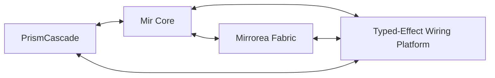

# Documentation Summary

## Repository purpose

This repository is the specification-first starting point for a family of systems centered on:

- **Mir** — semantic core language,
- **Mirrorea** — distributed fabric and control plane,
- **PrismCascade** — media graph kernel,
- **Typed-Effect Wiring Platform** — inspectable, routable, contract-aware effect layer.

## Current status

- The project is **pre-implementation / architecture-heavy**.
- The strongest design focus is on semantics, boundaries, invariants, and integration points.
- Some implementation skeletons exist only to make future work easier to organize.

## Decision-level summary

- **L0 (foundational)**
  - Causality is represented as an event graph / directed acyclic graph.
  - Effects and contracts are first-class.
  - Ownership/lifetimes matter and are not an afterthought.
  - Safe evolution is a design goal, not an operational afterthought.
- **L1 (strong direction)**
  - Keep Mir, Mirrorea, PrismCascade, and the Typed-Effect Wiring Platform separate but interoperable.
  - Prefer safe downstream addition and compatibility-preserving overlays.
- **L2 (active design)**
  - Exact boundary details between Prism and Mir.
  - Full semantics of fallback / preference chains.
  - Some concurrency and coroutine details.
- **L3 (exploratory)**
  - Knowledge classification strategy for the Reversed Library.
  - GUI-programming substrate.
  - Some advanced patching and visualization questions.

## Diagrams

See `docs/diagrams/`.

```mermaid
flowchart TD
    L0[Existing OS / Network / Device Runtime]
    L1[Mir Core]
    L2[Mirrorea Fabric]
    L3[Shared Space / Shared State]
    L4[Domain Engines]
PrismCascade / VR / Collaboration
    L5[Applications / Communities / Reversed Library]

    L0 --> L1 --> L2 --> L3 --> L4 --> L5
```



## Where to start next

1. Read `specs/00-document-map.md`
2. Then `specs/01-charter-and-decision-levels.md`
3. Then `specs/02-system-overview.md`
4. Then the subsystem you want to work on

## Reporting

All non-trivial work must generate a new file in `docs/reports/`.


## Current environment note

This scaffold was created in an environment where Python was available but `cargo` was not.
The Rust workspace skeleton is present, but compilation still needs to be validated on a Rust-enabled machine.
