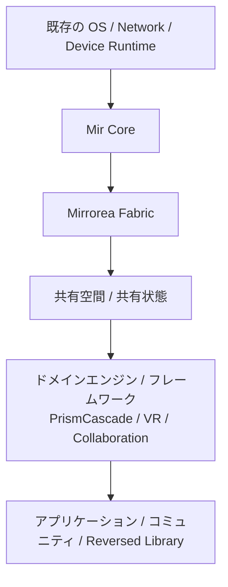
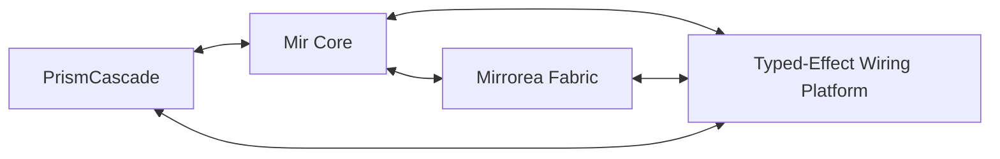

# ドキュメント要約

## リポジトリの目的

このリポジトリは、次のシステム群を中心とした**仕様先行の出発点**である。

- **Mir** — 意味論コア言語
- **Mirrorea** — 分散 fabric と制御プレーン（control plane）
- **PrismCascade** — メディアグラフ kernel
- **Typed-Effect Wiring Platform** — inspectable・routable・contract-aware な effect 層

## 現在の状態

- プロジェクトは**architecture / semantics first の段階**にある。
- 最も強い設計上の焦点は、意味論、境界、不変条件、統合点にある。
- ただし current repo は、もはや「実装 skeleton だけ」の状態ではない。
- current L2 には、parser-free PoC、`mir-ast` / `mir-semantics` / `mir-runtime` の narrow compile-ready path、fixed-subset source sample の runnable ladder まである。
- current L2 については、parser-free PoC 基盤と helper stack がかなり進んでおり、bundle / aggregate / static gate を含む detached validation loop の non-production 入口まで到達している。長期参照用の repository memory は `plan/` に整理している。
- Phase 5 closeout は `specs/examples/297...298` により fixed 済みである。checker-side current stop line は docs-only mixed-row verifier handoff bridge に留め、actual subject row、boundary-specific handoff artifact family、actual emitted verifier artifact、concrete tool binding、public checker migration、low-level memory-order family は retained-later に残す。Phase 6 parser first tranche は `specs/examples/299...300` と `crates/mir-ast/src/current_l2.rs`、checker/runtime first tranche は `specs/examples/301...302` と `crates/mir-semantics` program-level entry / `crates/mir-runtime/src/current_l2.rs`、compile-ready verification / formal hook は `specs/examples/303...304` と `crates/mir-semantics/examples/current_l2_emit_formal_hook.rs` / `scripts/current_l2_detached_loop.py` により fixed 済みである。`specs/examples/305...314` により parser second tranche first package、reserve formal tool binding inventory、parser-side follow-up sequencing、shared single attachment frame first packageも fixed / actualize 済みである。`specs/examples/315...318` により fixed-subset source-sample corpus scope / layout と representative / fixture / source mapping matrix も fixed 済みであり、repo-root `samples/current-l2/README.md` を actual path とする initial cluster `e1` `e2` `e3` `e4` `e21` `e23` を current first choice に置いた。`specs/examples/319...320` により actual parser-to-`Program` lowering first cut も fixed 済みであり、`mir_runtime::current_l2::lower_current_l2_fixed_source_text` を non-production helper-local lowerer に置き、initial sextet を semantic `Program` + optional stage 1 / stage 2 bridge evidence へ fail-closed に落とす current cut を採った。`specs/examples/321...322` により syntax-backed sample runner first cut も fixed 済みであり、`mir_runtime::current_l2::run_current_l2_source_sample` と `resolve_current_l2_source_sample_path` を helper-local thin wrapper に置き、accepted sample set 内の explicit path / sample stem shorthand と explicit `FixtureHostPlan` input だけを current cut に残した。`specs/examples/323...324` により verification ladder wiring first cut も fixed 済みであり、first authored trio `e2` / `e4` / `e23` に reached-stage row を付ける current cut を採った。さらに `specs/examples/333...334` により first widened authored row `e1` actualization、`specs/examples/335...336` により second widened authored row `e21` actualization、`specs/examples/337...338` により third widened row `e3` theorem-side / formal-hook guard comparison、`specs/examples/339...340` により plain proof-notebook bridge sketch actualization、`specs/examples/341...342` により compare-ready bridge sketch second reopen、`specs/examples/343...344` により deferred `e3` actualization reopen timing、`specs/examples/345...346` により actual `e3` authored-row actualization、`specs/examples/347...348` により proof/model-check first concrete tool pilot、`specs/examples/349...350` により second source-sample cluster sequencing、`specs/examples/351...352` により actual `e22` contrast-row source actualization、`specs/examples/353...354` により stable static malformed post-contrast sequencing、`specs/examples/355...356` により parser / checker / runtime public surface inventory、`specs/examples/357...358` により Mirrorea/shared-space docs-first re-entry bundle、`specs/examples/359...360` により model-check/public-checker second reserve inventory、`specs/examples/361...362` により stable-static edge-pair first reopen、`specs/examples/363...364` により public operational surface actualization gate、`specs/examples/365...366` により shared-space identity/auth layering reopen、`specs/examples/367...368` により model-check concrete carrier first actualization gate、`specs/examples/369...370` により stable malformed broader follow-up inventory、`specs/examples/371...372` により public operational CLI / final public contract later gate、`specs/examples/373...374` により shared-space admission / compile-time visibility reopen、`specs/examples/375...376` により shared-space authority / resource ownership reopen、`specs/examples/377...378` により model-check concrete carrier actualization comparison、`specs/examples/379...380` により model-check concrete carrier first actualization、`specs/examples/389...390` により final public parser / checker / runtime first later gate actualization comparison、`specs/examples/391...392` により stable malformed missing-option first source-backed widening actualization、`specs/examples/395...396` により final public parser / checker / runtime thin-facade later support actualization も fixed 済みである。current first concrete carrier は tool-neutral formal hook を入力にする row-local `proof_notebook_review_unit` に留めつつ、first machine-facing sibling artifact として `schema_version + artifact_kind + subject_kind + subject_ref + case(obligation_kind + evidence_refs)` の row-local model-check carrier list も actualize 済みである。first post-sextet runtime contrast pair は `e21` / `e22` に置き、current authored source sample は `e1` / `e2` / `e3` / `e4` / `e16` / `e19` / `e21` / `e22` / `e18` / `e23` の decet まで actualize 済みである。`e16` / `e18` actualization では helper-compatible source row、runner accepted set、regression helper、README ladder に加え、fixture-static formal-hook smoke widening まで actualize し、`e17` は same-family staged guard に留めた。stable-static edge-pair first reopen では existing `e4` row と new `e19` row を source-backed static-stop pair に actualize し、`e19` も runner / regression / ladder / fixture-static formal-hook smoke へ接続した。public surface inventory では already-public parser-free helper stack、crate-public but non-production compile-ready tranche、repo-local helper / example emitter surface の 3 bucket split を current reading に置いた。public operational surface actualization gate では、already-public parser-free stack を stable bucket に据えたまま、later public pressure の first docs-only candidate を `run_current_l2_source_sample` に narrow に置き、`run_current_l2_runtime_skeleton` / `lower_current_l2_fixed_source_text` を tranche-internal support、`resolve_current_l2_source_sample_path` と repo-local script/example surface を excluded bucket に留める current cut を fixed した。Mirrorea/shared-space docs-first re-entry では、`mirrorea_fabric_boundary + shared_space_practical_boundary` を current core bundle にし、Typed-Effect / Prism を adjacent track、shared-space final catalog と upper-layer app target を user-spec-required gate に置いた。shared-space identity/auth layering reopen では、membership core を `member_ref + principal_ref + member_incarnation + activation_state` に narrow に残しつつ、transport/service auth、room admission、display/projection identity を side carriers に押し分ける cut を fixed した。shared-space admission / compile-time visibility reopen では、role / capability / visibility / notify path requirement の over-approximation だけを compile-time に残し、actual admission / activation / active member set / reconciliation は runtime control-plane に残す cut を fixed した。shared-space authority / resource ownership reopen では、participant carrier を membership / activation に留めたまま、resource owner slot、delegated capability、consistency mode、fairness source を separate family に置き、authority placement は `single room authority` first、`replicated authority` next operational candidate、`relaxed projection authority` future comparison に残す current cut を fixed した。model-check/public-checker second reserve inventory では、`proof_notebook_review_unit` を current first pilot に維持したまま、model-check second reserve refs と public-checker docs-only chain を separate bucket に留め、concrete tool binding、actual public-checker promotion、actual emitted verifier handoff artifact は still later に残す cut を fixed した。sample-visible theorem/model-check line は actual model-check carrier first、source-sample emitted verification artifact wiring second、sample-facing theorem/model-check evidence summary and bless/review flow third に sequencing fixed 済みであり、`specs/examples/379...380` では tool-neutral formal hook only hard input から row-local machine-facing carrier list を actualize し、`proof_notebook_review_unit` current first theorem-side pilot を維持した。stable malformed broader follow-up inventory では、broader stable malformed next reopen order を missing-option family first (`e16/e17/e18`)、capability family second (`e13/e20`) に固定し、duplicate cluster と `TryFallback` / `AtomicCut` malformed-static family は kept-later に残す current cut を採った。public operational CLI / final public contract later gate では、`run_current_l2_source_sample` current gate を巻き戻さず、first later gate を final public parser / checker / runtime API、second later gate を public operational CLI に置き、`resolve_current_l2_source_sample_path` と accepted-set hard-coding、repo-local examples / Python helpers は current final contract の外へ残す current cut を採った。`e3` は helper-compatible inline-`admit` source row、runner accepted set、regression helper current authored inventory、README ladder へ narrow actualize して `static gate -> interpreter(success)` まで reached させつつ、current theorem-side consumer `proof_notebook_review_unit` と current formal-hook top `runtime_try_cut_cluster` を保った guard により `formal hook = not reached (guarded)` に留めている。theorem-side bridge は old theorem-line `specs/examples/140` / `141` の docs-only shape (`bridge_subject_ref + review_units + bridge_goal_text + comparison_basis_refs`) を current compare-ready second actualization として再利用した。repo-level current near-term path は `stable malformed capability second reopen actualization comparison` を current line に置き、その後に `public operational CLI concrete shell naming` を reserve に並べる読みへ更新した。
- `specs/examples/381...382` により、source-sample emitted verification artifact wiring も fixed 済みである。`run_current_l2_source_sample` と `CurrentL2SourceSampleRunReport` の public/report shape を変えず、runtime test/support helper-local emitted route として `source report -> formal hook reached/guarded split -> proof_notebook_review_units / model_check_concrete_carriers` fan-out を actualize した。この package close 時点では、repo-level current near-term path は `sample-facing theorem/model-check evidence summary and bless/review flow` を current line に置き、その次段を `docs-first I/O / host-facing port boundary`（working label）に置いていた。
- `specs/examples/383...384` により、sample-facing theorem/model-check evidence summary and bless/review flow も fixed 済みである。README / `.docs` / snapshot docs を current sample-facing surface に置き、`source sample -> runner/ladders -> formal hook reached/guarded -> proof_notebook_review_units / model_check_concrete_carriers` を current evidence route、reviewed repo-local sync + inventory/regression success を current bless に置く docs-first cut を採った。repo-level current near-term path は `docs-first I/O / host-facing port boundary`（working label）に進み、stable malformed missing-option widen と final public parser / checker / runtime API actualization は reserve に残す。
- `specs/examples/385...386` により、docs-first I/O / host-facing port boundary も fixed 済みである。language core に privileged `stdin/stdout` を入れず、capability-scoped input/output port / adapter boundary を first docs-only cut に置き、visualizer / host substrate / host runtime を consumer/provider 側、FFI / game engine adapter と final naming を later gate に残す current cut を採った。`host-facing port` は settled term ではなく working label に留め、Typed-Effect Wiring Platform と Mirrorea/shared-space の affiliation も OPEN に残す。repo-level current near-term path は `stable malformed missing-option first reopen actualization comparison` に進んだ。
- `specs/examples/387...388` により、stable malformed missing-option first reopen actualization comparison も fixed 済みである。existing helper-local missing-option compare を entry evidence に再利用しつつ、first reopen family は `e16/e17/e18` triplet に維持し、current next actualization mode は source-backed widening first に置く current cut を採った。implementation cut を narrower に取る場合でも `e16` lead は staging note に留め、capability second、duplicate later、`TryFallback` / `AtomicCut` malformed-static later を維持する。repo-level current near-term path は `final public parser / checker / runtime API first later gate actualization comparison` に進んだ。
- `specs/examples/389...390` により、final public parser / checker / runtime first later gate actualization comparison も fixed 済みである。current first later cut は `run_current_l2_source_sample` と `CurrentL2SourceSampleRunReport` を public entry / report に置く runtime-led thin library facade に留め、`CurrentL2LoweredSourceProgram` / `CurrentL2RuntimeSkeletonReport` / `CurrentL2CheckerFloorReport` / `RunReport` を nested carrier として扱う。`run_current_l2_runtime_skeleton`、`lower_current_l2_fixed_source_text`、semantic/checker core、parser carrier floor は support-only bucket、`resolve_current_l2_source_sample_path`、accepted-set hard-coding、repo-local helper / example surface は excluded bucket に残す。repo-level current near-term path は `stable malformed missing-option first source-backed widening actualization` に進んだ。
- `specs/examples/391...392` により、stable malformed missing-option first source-backed widening actualization も fixed 済みである。`e16-malformed-missing-chain-head-option` と `e18-malformed-missing-successor-option` を source-authored static-stop pair として `samples/current-l2/`、`mir-runtime` source lowerer / runner / ladder tests、repo-local regression helper まで widen し、`e17-malformed-missing-predecessor-option` は same-family staged guard に留める current cut を採った。repo-level current near-term path は `public operational CLI second later gate actualization comparison` に進んだ。
- `specs/examples/393...394` により、public operational CLI second later gate actualization comparison も fixed 済みである。current first cut は runtime-led thin facade を巻き戻さない Rust-side operational wrapper over `run_current_l2_source_sample` に留め、operational shell concern は `sample_selector_argument` / `explicit_host_plan_input_mode` / `source_sample_run_report_json_or_pretty_summary` に narrow に置く。`run_current_l2_runtime_skeleton` / `lower_current_l2_fixed_source_text` は still support-only、`resolve_current_l2_source_sample_path`、accepted-set hard-coding、repo-local Python orchestration helper、cargo example emitter / support module は excluded bucket に残し、concrete command 名 / flag 名 / final host-input contract は still later に残す。
- `specs/examples/395...396` により、final public parser / checker / runtime thin-facade later support actualization も fixed 済みである。current first later-support cut は `run_current_l2_runtime_skeleton` と `CurrentL2RuntimeSkeletonReport` に置き、explicit input surface は `Program` / `FixtureHostPlan` / optional `CurrentL2ParserBridgeInput` に留める。`lower_current_l2_fixed_source_text`、semantic/checker core、parser carrier floor は deeper-support bucket に残し、`run_current_l2_source_sample` first public cut と Rust-side operational wrapper second gate は巻き戻さない。repo-level current near-term path は `stable malformed capability second reopen actualization comparison` に進み、`public operational CLI concrete shell naming` は reserve に残る。
- `specs/examples/397...398` により、stable malformed capability second reopen actualization comparison も fixed 済みである。current family judgment は `e13` / `e20` pair に維持しつつ、helper-local capability compare、stage1 reconnect widen、fixture-static capability rows を entry evidence に再利用し、next malformed-side actualization mode は source-backed widening first に置く。`e13` lead は implementation staging note に留め、duplicate cluster と `TryFallback` / `AtomicCut` malformed-static family は still later に残す。repo-level current near-term path は `public operational CLI concrete shell naming comparison` に進み、`stable malformed capability second source-backed widening actualization comparison` は malformed-side next reopen point に残る。
- `specs/examples/399...400` により、public operational CLI concrete shell naming comparison も fixed 済みである。current docs-only shell family は `mir-current-l2 run-source-sample` に留め、operational shell concern は `<sample>`、`--host-plan <path>`、`--format pretty|json` に限定する。final `mir` top-level hierarchy、inventory / regression helper verb、runtime-skeleton / lowering support verb、repo-local Python helper / cargo example naming は excluded bucket に残し、actual CLI binary / final host-input contract は still later に残す。repo-level current near-term path は `stable malformed capability second source-backed widening actualization comparison` に進み、`public operational CLI concrete shell actualization comparison` は later reserve に残る。
- `specs/examples/401...402` により、stable malformed capability second source-backed widening actualization comparison も fixed 済みである。current actualization family は `e13-malformed-capability-strengthening` / `e20-malformed-late-capability-strengthening` の source-authored static-stop pair に置き、helper-local capability compare、stage1 reconnect widen、fixture-static capability rows を entry evidence として再利用する。current actualized surface は source sample / lowerer / runner / ladder / regression helper / fixture-static formal-hook smoke までに留め、implementation order を narrower に取る場合でも `e13` lead は staging note に留める。duplicate cluster、`TryFallback` / `AtomicCut` malformed-static broader family、theorem/model-check/public-checker wideningは still later に残す。repo-level current near-term path は `public operational CLI concrete shell actualization comparison` に進み、`stable malformed capability second source-backed widening actualization` は malformed-side next actual package に残る。
- Phase 3 reserve path では `specs/examples/287...290` により minimal parser subset freeze と parser-to-checker reconnect freeze を fixed し、actual parser first tranche の accepted cluster を stage 1 + stage 2 structural floor、first checker reconnect bridge を stage 1 summary + stage 2 try/rollback structural contract に置く current cut まで進んでいる。stage 3 request / predicate reconnect、`e19` direct target mismatch redesign、`E21` / `E22` runtime contrast は still later に残す。
- Phase 1 closeout は `specs/examples/291...292` により fixed 済みである。current L2 semantics は guarded option chain / `try` / `atomic_cut` の settled reading を維持しつつ、`specs/09` invariants と Phase 5 proof-obligation wording の橋を明示し、companion notation は explicit edge-row family、A2 polished first choice、A1 shorthand の関係まで固定した。final parser grammar、final type system、actual external schema は still later に残す。
- Phase 2 closeout は `specs/examples/293...294` により fixed 済みである。parser-free companion baseline は interpreter suite、detached loop unit suite、3 example emitter compile gate、`smoke-fixture`、`compare-fixture-aggregates`、`smoke-try-rollback-structural-checker` を current gate に置き、runtime bundle/aggregate path、static-gate-side checker smoke family、display-only authoring assists の責務を分けた narrow closeout bundle として固定した。detached loop は compare-only / non-production helper に留め、`target/current-l2-detached/` は current default candidate であって final retention/path policy ではない。reference update / bless、final retention/path policy、public exporter API は still later に残す。
- Phase 4 closeout は `specs/examples/295...296` により fixed 済みである。shared-space self-driven current package は `specs/examples/121...125` までで checkpoint close と読み、authoritative room baseline、small working subset、minimal witness core、authoritative delegated-provider practical cut、control-plane threshold を current package refs に束ねた。`append_friendly_room_with_rng_capability` row は optional capability source を current row に残すが、`delegated_provider_attestation` は room-core claim に固定しない。final activation / authority / auth / identity / admission / consistency / fairness catalog は user-spec-required に残し、control-plane separated carrier actualization、distributed fairness protocol、final operational realizationは retained-later に残す。
- ただし actual code path は still uneven である。`mir-semantics` には parser-free current L2 minimal interpreter に加えて public behavior を already 持つ bundle / discovery / selection / profile helper stack、program-level static gate / evaluator / host-runner entry、theorem-line整合の tool-neutral formal hook emitter、`crates/mir-semantics/examples/support/current_l2_proof_notebook_review_unit_support.rs` と `crates/mir-semantics/examples/support/current_l2_model_check_carrier_support.rs` および対応 example CLI による review-unit / model-check-carrier helper-local emitters が入った。`mir-ast` には stage 1 option/chain と stage 2 try/fallback structural floor、declaration-side admit attached slot、shared isolated predicate fragment、shared single attachment frame extraction bridge を持つ crate-public but non-production `current_l2` carrier がある。`mir-runtime` には semantic `Program` と optional parser bridge input を受ける crate-public but non-production `current_l2` thin skeleton、fixed-subset source sample current authored decet `e1` / `e2` / `e3` / `e4` / `e16` / `e19` / `e21` / `e22` / `e18` / `e23` を lower する helper-local lowerer、source sample を read / lower / static / interpreter へ束ねる helper-local runner、authored decet reached-stage inventory を machine-check する test-only ladder ratchetが入り、repo root には `python3 scripts/current_l2_source_sample_regression.py` と `.docs/current-l2-source-sample-authoring-policy.md` による repo-local inventory / regression flowもある。shared-space identity/auth layering、admission/compile-time visibility、authority/resource ownership は docs-first boundary まで fixed したが、final activation / authority / auth / consistency / fairness catalog と operational realization は still later に残る。`e17` source-authored widening、bridge sketch / compare-bless metadata、concrete theorem/model-check tool binding、`mir-lsp` / final public crate surface も still later に残る。LLVM-family backend や higher-level async-control / low-level memory-order-like surface も、これらの前段としては扱わない。

## Decision level 要約

- **L0（基盤）**
  - 因果は event graph / directed acyclic graph で表現される。
  - effect と contract は first-class である。
  - ownership / lifetime は後付けではなく本質的である。
  - 安全な進化は運用上の付随物ではなく設計目標である。
- **L1（強い方向性）**
  - Mir、Mirrorea、PrismCascade、Typed-Effect Wiring Platform は分離しつつ相互運用可能に保つ。
  - downstream addition と compatibility-preserving overlay を優先する。
- **L2（設計提案）**
  - Prism と Mir の正確な境界詳細
  - fallback / preference chains の完全意味論
  - 一部の concurrency / coroutine 詳細
- **L3（探索段階）**
  - Reversed Library の知識分類戦略
  - GUI プログラミング基盤
  - 一部の高度な patching / visualization の論点

## 図

`docs/diagrams/` を参照。

## 次にどこから読むか

1. `specs/00-document-map.md`
2. 次に `specs/01-charter-and-decision-levels.md`
3. 次に `specs/02-system-overview.md`
4. 次に `specs/03-layer-model.md` と `specs/09-invariants-and-constraints.md`
5. current repo の現況、roadmap、helper stack、PoC 境界を早く掴みたいときは `plan/00-index.md`
6. 直近の概算進捗、残課題、validation loop までの rough step estimate を先に見たいときは `progress.md`
7. repo 全体の研究 phase、現在位置、重さ、自走可否を見たいときは `plan/17-research-phases-and-autonomy-gates.md`
8. いま自走で進める task と、後段で方針決定が必要な open question / later blocker を素早く見たいときは `tasks.md`
9. shared-space / membership / authoritative room の docs-first boundary を先に掴みたいときは `plan/16-shared-space-membership-and-example-boundary.md`、`specs/examples/121-shared-space-authoritative-room-baseline.md`、`specs/examples/122-shared-space-catalog-working-subset-comparison.md`、`specs/examples/123-shared-space-auditable-authority-witness-minimal-shape.md`、`specs/examples/124-shared-space-authoritative-room-delegated-rng-provider-placement.md`、`specs/examples/125-shared-space-control-plane-carrier-threshold.md`、`specs/examples/295-current-l2-phase2-parser-free-poc-closeout-ready-phase4-shared-space-self-driven-closeout-comparison.md`、`specs/examples/296-current-l2-phase4-shared-space-self-driven-closeout-ready-minimal-phase4-shared-space-self-driven-closeout-threshold.md`、`specs/examples/357-current-l2-parser-checker-runtime-public-surface-inventory-ready-mirrorea-shared-space-docs-first-re-entry-comparison.md`、`specs/examples/358-current-l2-mirrorea-shared-space-docs-first-re-entry-ready-minimal-mirrorea-shared-space-docs-first-re-entry-threshold.md`
10. Phase 5 の small decidable core / proof / async-control boundary を先に掴みたいときは `specs/examples/30-current-l2-first-checker-cut-entry-criteria.md`、`specs/examples/126-current-l2-small-decidable-core-and-proof-boundary-inventory.md`、`specs/examples/127-current-l2-proof-obligation-matrix-and-external-handoff-artifact.md`、`specs/examples/128-current-l2-handoff-artifact-threshold-comparison.md`、`specs/examples/129-current-l2-first-external-consumer-pressure-comparison.md`、`specs/examples/130-current-l2-theorem-line-narrow-actualization-comparison.md`、`specs/examples/131-current-l2-theorem-line-evidence-ref-family-comparison.md`、`specs/examples/132-current-l2-theorem-line-public-checker-migration-threshold.md`、`specs/examples/133-current-l2-theorem-line-minimum-contract-row-comparison.md`、`specs/examples/134-current-l2-theorem-line-consumer-class-comparison.md`、`specs/examples/135-current-l2-theorem-line-notebook-attachment-family-comparison.md`、`specs/examples/136-current-l2-theorem-line-notebook-bridge-artifact-threshold.md`、`specs/examples/137-current-l2-theorem-line-next-consumer-pressure-comparison.md`、`specs/examples/138-current-l2-theorem-line-concrete-notebook-workflow-pressure-comparison.md`、`specs/examples/139-current-l2-theorem-line-notebook-review-unit-named-bundle-threshold.md`、`specs/examples/140-current-l2-theorem-line-review-unit-to-bridge-sketch-comparison.md`、`specs/examples/141-current-l2-theorem-line-bridge-sketch-compare-metadata-threshold.md`、`specs/examples/142-current-l2-theorem-line-compare-ready-bridge-bless-decision-threshold.md`、`specs/examples/143-current-l2-theorem-line-bless-ready-bridge-review-session-threshold.md`、`specs/examples/144-current-l2-theorem-line-review-linked-bless-bridge-retained-notebook-threshold.md`、`specs/examples/145-current-l2-theorem-line-retained-bridge-review-session-link-threshold.md`、`specs/examples/146-current-l2-theorem-line-session-linked-retained-bridge-review-observation-threshold.md`、`specs/examples/147-current-l2-theorem-line-observed-session-lifecycle-threshold.md`、`specs/examples/148-current-l2-theorem-line-lifecycle-ready-retention-state-threshold.md`、`specs/examples/149-current-l2-theorem-line-retention-ready-path-policy-threshold.md`、`specs/examples/150-current-l2-theorem-line-path-ready-emitted-artifact-threshold.md`、`specs/examples/151-current-l2-theorem-line-emitted-ready-handoff-emitter-threshold.md`、`specs/examples/152-current-l2-theorem-line-emitter-linked-consumer-adapter-threshold.md`、`specs/examples/153-current-l2-theorem-line-adapter-linked-exchange-rule-threshold.md`、`specs/examples/154-current-l2-theorem-line-exchange-ready-adapter-validation-threshold.md`、`specs/examples/155-current-l2-theorem-line-validation-ready-invocation-surface-threshold.md`、`specs/examples/156-current-l2-theorem-line-invocation-ready-exchange-body-threshold.md`、`specs/examples/157-current-l2-theorem-line-exchange-body-ready-runtime-coupling-threshold.md`、`specs/examples/158-current-l2-theorem-line-runtime-coupling-ready-transport-protocol-threshold.md`、`specs/examples/159-current-l2-theorem-line-transport-ready-failure-body-threshold.md`、`specs/examples/160-current-l2-theorem-line-failure-ready-actual-invocation-protocol-threshold.md`、`specs/examples/161-current-l2-theorem-line-invocation-ready-host-binding-threshold.md`、`specs/examples/162-current-l2-theorem-line-binding-ready-failure-wording-threshold.md`、`specs/examples/163-current-l2-theorem-line-wording-ready-runtime-handoff-threshold.md`、`specs/examples/164-current-l2-theorem-line-runtime-handoff-ready-invocation-receipt-threshold.md`、`specs/examples/165-current-l2-theorem-line-invocation-receipt-ready-runtime-transcript-threshold.md`、`specs/examples/166-current-l2-theorem-line-transcript-ready-materialized-runtime-handoff-threshold.md`、`specs/examples/167-current-l2-theorem-line-materialized-ready-concrete-payload-threshold.md`、`specs/examples/168-current-l2-theorem-line-payload-ready-concrete-transcript-threshold.md`、`specs/examples/169-current-l2-theorem-line-transcript-body-ready-serialized-channel-body-threshold.md`、`specs/examples/170-current-l2-theorem-line-serialized-ready-emitted-attachment-body-threshold.md`、`specs/examples/171-current-l2-theorem-line-attachment-body-ready-emitted-attachment-blob-threshold.md`、`specs/examples/172-current-l2-theorem-line-attachment-blob-ready-retained-file-body-threshold.md`、`specs/examples/173-current-l2-theorem-line-retained-file-body-ready-archive-materialization-threshold.md`、`specs/examples/174-current-l2-theorem-line-archive-materialization-ready-archive-body-bundle-threshold.md`、`specs/examples/175-current-l2-theorem-line-archive-body-ready-archive-bundle-threshold.md`、`specs/examples/176-current-l2-theorem-line-archive-bundle-ready-archive-manifest-threshold.md`、`specs/examples/177-current-l2-theorem-line-archive-manifest-ready-archive-member-family-threshold.md`、`specs/examples/178-current-l2-theorem-line-archive-member-family-ready-archive-member-body-compare-threshold.md`、`specs/examples/179-current-l2-theorem-line-archive-member-body-compare-ready-archive-bless-update-policy-threshold.md`、`specs/examples/180-current-l2-theorem-line-archive-bless-update-policy-ready-retained-archive-payload-threshold.md`、`specs/examples/181-current-l2-theorem-line-retained-archive-payload-ready-archive-retention-layout-threshold.md`、`specs/examples/182-current-l2-theorem-line-archive-retention-layout-ready-retained-archive-payload-body-family-threshold.md`、`specs/examples/183-current-l2-theorem-line-retained-archive-payload-body-family-ready-retained-payload-materialization-family-threshold.md`、`specs/examples/184-current-l2-theorem-line-retained-payload-materialization-family-ready-retained-payload-body-materialization-detail-threshold.md`、`specs/examples/185-current-l2-theorem-line-retained-payload-body-materialization-detail-ready-retained-payload-body-materialization-payload-threshold.md`、`specs/examples/186-current-l2-theorem-line-retained-payload-body-materialization-payload-ready-retained-payload-body-materialization-carrier-detail-threshold.md`、`specs/examples/187-current-l2-theorem-line-retained-payload-body-materialization-carrier-detail-ready-retained-payload-body-materialization-carrier-payload-threshold.md`、`specs/examples/188-current-l2-theorem-line-retained-payload-body-materialization-carrier-payload-ready-retained-payload-bless-update-split-threshold.md`、`specs/examples/189-current-l2-theorem-line-retained-payload-bless-update-split-ready-retained-payload-bless-update-row-pair-threshold.md`、`specs/examples/190-current-l2-theorem-line-retained-payload-bless-update-row-pair-ready-retained-payload-bless-update-row-ref-family-threshold.md`、`specs/examples/191-current-l2-theorem-line-retained-payload-bless-update-row-ref-family-ready-retained-payload-bless-update-dual-ref-bundle-threshold.md`、`specs/examples/192-current-l2-theorem-line-retained-payload-bless-update-dual-ref-bundle-ready-retained-payload-bless-update-strict-dual-field-threshold.md`、`specs/examples/193-current-l2-theorem-line-retained-payload-bless-update-strict-dual-field-ready-consumer-visible-pair-threshold.md`、`specs/examples/194-current-l2-theorem-line-consumer-visible-pair-ready-boundary-specific-handoff-pair-threshold.md`、`specs/examples/195-current-l2-theorem-line-boundary-specific-handoff-pair-ready-actual-handoff-pair-shape-threshold.md`、`specs/examples/196-current-l2-theorem-line-actual-handoff-pair-shape-ready-boundary-specific-handoff-artifact-row-threshold.md`、`specs/examples/197-current-l2-theorem-line-boundary-specific-handoff-artifact-row-ready-external-contract-facing-handoff-row-threshold.md`、`specs/examples/198-current-l2-theorem-line-external-contract-facing-handoff-row-ready-actual-external-contract-threshold.md`、`specs/examples/199-current-l2-theorem-line-actual-external-contract-ready-consumer-specific-external-contract-payload-threshold.md`、`specs/examples/200-current-l2-theorem-line-external-contract-payload-ready-proof-hint-threshold.md`、`specs/examples/201-current-l2-theorem-line-proof-hint-ready-consumer-hint-threshold.md`、`specs/examples/202-current-l2-theorem-line-consumer-hint-ready-second-consumer-pressure-threshold.md`、`specs/examples/203-current-l2-theorem-line-second-consumer-pressure-ready-proof-assistant-adapter-contract-threshold.md`、`specs/examples/204-current-l2-theorem-line-proof-assistant-adapter-contract-ready-theorem-export-checker-pressure-threshold.md`、`specs/examples/205-current-l2-theorem-line-theorem-export-checker-pressure-ready-checker-facing-contract-threshold.md`、`specs/examples/206-current-l2-theorem-line-theorem-export-checker-contract-ready-exported-checker-payload-pressure-threshold.md`、`specs/examples/207-current-l2-theorem-line-theorem-export-checker-payload-pressure-ready-actual-exported-checker-payload-threshold.md`、`specs/examples/208-current-l2-theorem-line-actual-exported-checker-payload-ready-checker-result-materialization-family-threshold.md`、`specs/examples/209-current-l2-theorem-line-checker-result-materialization-family-ready-actual-checker-result-payload-threshold.md`、`specs/examples/210-current-l2-theorem-line-actual-checker-result-payload-ready-checker-verdict-carrier-detail-threshold.md`、`specs/examples/211-current-l2-theorem-line-checker-verdict-carrier-detail-ready-checker-verdict-payload-family-threshold.md`、`specs/examples/212-current-l2-theorem-line-checker-verdict-payload-family-ready-checker-verdict-witness-family-threshold.md`、`specs/examples/213-current-l2-theorem-line-checker-verdict-witness-family-ready-checker-verdict-transport-family-threshold.md`、`specs/examples/214-current-l2-theorem-line-checker-verdict-transport-family-ready-checker-verdict-transport-carrier-detail-threshold.md`、`specs/examples/215-current-l2-theorem-line-checker-verdict-transport-carrier-detail-ready-checker-verdict-transport-payload-threshold.md`、`specs/examples/216-current-l2-theorem-line-checker-verdict-transport-payload-ready-checker-verdict-transport-receipt-threshold.md`、`specs/examples/217-current-l2-theorem-line-checker-verdict-transport-receipt-ready-checker-verdict-transport-channel-body-threshold.md`
- Phase 5 closeout fixed の stop line と retained-later inventory 自体は `specs/examples/297-current-l2-phase4-shared-space-self-driven-closeout-ready-phase5-proof-protocol-runtime-policy-handoff-closeout-comparison.md` と `specs/examples/298-current-l2-phase5-proof-protocol-runtime-policy-handoff-closeout-ready-minimal-phase5-proof-protocol-runtime-policy-handoff-closeout-threshold.md` を参照する。
11. low-level memory-order family を theorem-line retained bridge に入れず、transport channel body を current stop line に維持する threshold judgment は `specs/examples/218-current-l2-theorem-line-checker-verdict-transport-channel-body-ready-low-level-memory-order-family-threshold.md`
12. higher-level async-control family の current first cut を `authority_serial_transition_family` に置く comparison と、その symbolic retained bridge threshold は `specs/examples/219-current-l2-theorem-line-checker-verdict-transport-channel-body-ready-higher-level-async-control-family-comparison.md` と `specs/examples/220-current-l2-theorem-line-higher-level-async-control-family-ready-authority-serial-transition-family-threshold.md`
13. authority-serial transition line を family marker から minimal contract row、さらに owner-slot detail へどこまで narrow に actualize してよいかは `specs/examples/221-current-l2-theorem-line-authority-serial-transition-family-ready-authority-serial-transition-contract-comparison.md`、`specs/examples/222-current-l2-theorem-line-authority-serial-transition-contract-ready-minimal-authority-serial-contract-threshold.md`、`specs/examples/223-current-l2-theorem-line-minimal-authority-serial-contract-ready-authority-serial-row-detail-comparison.md`、`specs/examples/224-current-l2-theorem-line-authority-serial-row-detail-ready-authority-owner-ref-threshold.md`
14. authority-serial transition line の owner-slot detail の次段として、symbolic stage family をどこまで retained bridge に actualize してよいかは `specs/examples/225-current-l2-theorem-line-authority-owner-ref-ready-authority-transition-stage-family-comparison.md` と `specs/examples/226-current-l2-theorem-line-authority-transition-stage-family-ready-minimal-authority-transition-stage-family-threshold.md`
15. authority transition line の symbolic stage family の次段として、actual ordered stage sequence をどこまで retained bridge に actualize してよいかは `specs/examples/227-current-l2-theorem-line-minimal-authority-transition-stage-family-ready-authority-transition-stage-sequence-shape-comparison.md` と `specs/examples/228-current-l2-theorem-line-authority-transition-stage-sequence-shape-ready-minimal-authority-transition-stage-sequence-threshold.md`
16. authority transition line の actual ordered stage sequence の次段として、symbolic stage-local obligation family をどこまで retained bridge に actualize してよいかは `specs/examples/229-current-l2-theorem-line-minimal-authority-transition-stage-sequence-ready-stage-local-obligation-family-comparison.md` と `specs/examples/230-current-l2-theorem-line-stage-local-obligation-family-ready-minimal-authority-stage-local-obligation-family-threshold.md`
17. authority transition line の symbolic stage-local obligation family の次段として、actual stage-local obligation row detail をどこまで retained bridge に actualize してよいかは `specs/examples/231-current-l2-theorem-line-minimal-authority-stage-local-obligation-family-ready-stage-local-obligation-row-detail-comparison.md` と `specs/examples/232-current-l2-theorem-line-stage-local-obligation-row-detail-ready-minimal-authority-stage-local-obligation-row-detail-threshold.md`
18. authority transition line の actual stage-local obligation row detail の次段として、symbolic authority handoff epoch ref をどこまで retained bridge に actualize してよいかは `specs/examples/233-current-l2-theorem-line-minimal-authority-stage-local-obligation-row-detail-ready-authority-handoff-epoch-ref-comparison.md` と `specs/examples/234-current-l2-theorem-line-authority-handoff-epoch-ref-ready-minimal-authority-handoff-epoch-ref-threshold.md`
19. authority transition line の symbolic authority handoff epoch ref の次段として、symbolic witness-aware handoff family をどこまで retained bridge に actualize してよいかは `specs/examples/235-current-l2-theorem-line-minimal-authority-handoff-epoch-ref-ready-witness-aware-handoff-family-comparison.md` と `specs/examples/236-current-l2-theorem-line-witness-aware-handoff-family-ready-minimal-witness-aware-handoff-family-threshold.md`
20. authority handoff line の symbolic witness-aware handoff family の次段として、actual handoff witness row detail をどこまで retained bridge に actualize してよいかは `specs/examples/237-current-l2-theorem-line-minimal-witness-aware-handoff-family-ready-handoff-witness-row-detail-comparison.md` と `specs/examples/238-current-l2-theorem-line-handoff-witness-row-detail-ready-minimal-handoff-witness-row-detail-threshold.md`
21. actual handoff witness row detail の次段として、symbolic replay attachment ref をどこまで retained bridge に actualize してよいかは `specs/examples/239-current-l2-theorem-line-minimal-handoff-witness-row-detail-ready-replay-attachment-ref-comparison.md` と `specs/examples/240-current-l2-theorem-line-replay-attachment-ref-ready-minimal-replay-attachment-ref-threshold.md`
22. symbolic replay attachment ref の次段として、symbolic handoff payload ref をどこまで retained bridge に actualize してよいかは `specs/examples/241-current-l2-theorem-line-minimal-replay-attachment-ref-ready-handoff-payload-ref-comparison.md` と `specs/examples/242-current-l2-theorem-line-handoff-payload-ref-ready-minimal-handoff-payload-ref-threshold.md`
23. symbolic handoff payload ref の次段として、minimal handoff carrier detail をどこまで retained bridge に actualize してよいかは `specs/examples/243-current-l2-theorem-line-minimal-handoff-payload-ref-ready-handoff-carrier-detail-comparison.md` と `specs/examples/244-current-l2-theorem-line-handoff-carrier-detail-ready-minimal-handoff-carrier-detail-threshold.md`
24. minimal handoff carrier detail の次段として、symbolic handoff transport family をどこまで retained bridge に actualize してよいかは `specs/examples/245-current-l2-theorem-line-minimal-handoff-carrier-detail-ready-handoff-transport-family-comparison.md` と `specs/examples/246-current-l2-theorem-line-handoff-transport-family-ready-minimal-handoff-transport-family-threshold.md`
- phase ごとの本質だけを短く読み返したいときは `docs/research_abstract/`
- その後、必要な subsystem に進む
25. representative code で current L2 の書き味を確認したいときは `specs/examples/00-representative-mir-programs.md`
26. その examples で使う `perform`、option chain 参照、`try` / `fallback`、`require` / `ensure` clause、separator / block nesting の候補書式は `specs/examples/01-current-l2-surface-syntax-candidates.md`
27. parser なしで representative examples を machine-readable に扱う最小 AST fixture schema は `specs/examples/02-current-l2-ast-fixture-schema.md`、fixture 実体は `crates/mir-ast/tests/fixtures/current-l2/`
28. parser なし最小 interpreter に必要な evaluation state schema は `specs/examples/03-current-l2-evaluation-state-schema.md`
29. parser なし最小 interpreter の 1-step semantics は `specs/examples/04-current-l2-step-semantics.md`
30. parser なし最小 interpreter の predicate / effect oracle API は `specs/examples/05-current-l2-oracle-api.md`
31. parser なし最小 interpreter skeleton の実装境界は `specs/examples/06-current-l2-interpreter-skeleton.md`
32. current L2 host stub / fixture runner harness の最小境界は `specs/examples/07-current-l2-host-stub-harness.md`
33. current L2 host harness が読む machine-readable host plan schema と `.host-plan.json` sidecar 方針は `specs/examples/08-current-l2-host-plan-schema.md`
34. current L2 fixture と sidecar を 1 組として扱う bundle loader / bundle-level helper は `specs/examples/09-current-l2-bundle-loader.md`
35. current L2 fixture directory を bundle 群として一括実行する batch runner は `specs/examples/10-current-l2-batch-runner.md`
36. current L2 batch runner の上に薄く載る bundle selection helper は `specs/examples/11-current-l2-selection-helper.md`
37. current L2 selection helper の primitive mode を組み合わせる profile helper は `specs/examples/12-current-l2-selection-profiles.md`
38. current L2 selection profile helper の上に薄く載る small named profile catalog は `specs/examples/13-current-l2-profile-catalog.md`
39. current L2 named profile catalog を hard-coded table に留めるか、machine-readable asset として比較する整理は `specs/examples/14-current-l2-profile-catalog-externalization.md`
40. fallback / `lease` の semantic reconciliation と compact syntax candidate comparison は `specs/examples/15-current-l2-fallback-reconciliation-and-compact-syntax.md`
41. current L2 detached trace / audit artifact の docs-only minimal schema と exact-compare core / explanation の境界は `specs/examples/16-current-l2-detached-trace-audit-artifact-schema.md`
42. detached artifact exporter を narrow に始めるなら `RunReport` / `BundleRunReport` / `BatchRunSummary` のどこを entry に切るべきか、という comparison は `specs/examples/17-current-l2-detached-exporter-entry-comparison.md`
43. bundle-first detached exporter で `RunReport` payload core と `FixtureBundle` context をどう分け、`host_plan_coverage_failure` をどこに残すか、という docs-only split は `specs/examples/18-current-l2-bundle-first-detached-payload-context-split.md`
44. `host_plan_coverage_failure` を current detached artifact では aggregate-only に残しつつ、将来 typed carrier に昇格させるならどの layer が自然か、という比較は `specs/examples/19-current-l2-host-plan-coverage-failure-placement.md`
45. `host_plan_coverage_failure` を将来 bundle failure artifact 側の typed carrier に昇格させるなら、その最小 schema をどう切るかの docs-only refinement は `specs/examples/20-current-l2-host-plan-coverage-failure-bundle-failure-artifact-schema.md`
46. bundle failure artifact 側の `failure.failure_kind` discriminator-only schema を `BatchRunSummary` aggregate export がどこまで typed に吸うべきか、という narrow comparison は `specs/examples/21-current-l2-host-plan-coverage-failure-aggregate-connection.md`
47. aggregate export 側に typed histogram / kind count を入れるなら、その field 名と migration cut をどう切るかの docs-only refinement は `specs/examples/22-current-l2-host-plan-coverage-failure-aggregate-histogram-migration.md`
48. detached exporter chain の current docs-only judgment、bundle-first loop attachment、typed failure / aggregate migration の統合 view は `specs/examples/23-current-l2-detached-export-loop-consolidation.md`
49. detached validation loop を回すときの aggregate export 接続、artifact 保存先 / path policy、file naming / overwrite policy、compare input discovery の最小 cut は `specs/examples/24-current-l2-detached-export-storage-and-aggregate-api.md`
50. detached validation loop の aggregate 側 actual narrow cut、`bundle_failure_kind_counts` と current list anchor の coexistence、aggregate emitter sketch は `specs/examples/25-current-l2-detached-aggregate-emitter-sketch.md`
51. detached validation loop の aggregate compare contract と `compare-aggregates` wrapper の最小 cut は `specs/examples/26-current-l2-detached-aggregate-compare-helper.md`
52. fixture authoring の boilerplate だけを `target/` 下へ切り出す non-production scaffold helper の最小 cut は `specs/examples/27-current-l2-fixture-scaffold-helper.md`
53. detached validation loop で 1 fixture を bundle emit / optional reference compare / single-fixture aggregate smoke まで 1 command で回す non-production helper 境界は `specs/examples/28-current-l2-detached-fixture-validation-loop-helper.md`
54. final grammar を固定する前に、first parser cut に入れてよい semantic cluster と companion notation に残す cluster を narrow に棚卸しする inventory は `specs/examples/29-current-l2-first-parser-subset-inventory.md`
55. first parser cut inventory の次段として、current L2 で core checker に入れてよい local / structural judgment と theorem prover / model checker へ残す judgment の切り分けは `specs/examples/30-current-l2-first-checker-cut-entry-criteria.md`
56. first parser cut inventory を actual parser spike へ送る順序として、chain / declaration structural floor → `try` / rollback structural floor → request / admissibility cluster の checker-led staged spike が current next narrow step である、という sequencing judgment は `specs/examples/73-current-l2-first-parser-spike-staging.md`
57. Phase 3 current tranche の closeout 後に、self-driven でなお reopen する価値があるかを比較した threshold judgment は `specs/examples/120-current-l2-phase3-self-driven-reopen-threshold.md`
58. その stage 1 を actual parser spike として切るなら、option declaration core / explicit edge-row family / edge-local lineage metadata / declaration-side guard slot を structural floor に限って受け、guard fragment 自体の parse は later stage に残す current judgment は `specs/examples/74-current-l2-stage1-parser-spike-entry-criteria.md`
59. stage 1 の declaration-side guard slot を actual parser / checker handoff へ送るときは、parser-side opaque slot carrier を持ちつつ current parser-free AST fixture schema の `OptionDecl.lease` へ narrow lowering するのが自然だという current judgment は `specs/examples/75-current-l2-stage1-parser-guard-slot-handoff.md`
59. その handoff で parser-side opaque slot carrier の naming と thin lowering bridge の private API surface を narrow に決めるなら、`decl_guard_slot` を第一候補とし、bridge は slot-only ではなく option-level structural transfer として読むのが自然だという current judgment は `specs/examples/76-current-l2-stage1-parser-opaque-slot-carrier-and-bridge-api.md`
60. actual parser spike の stage 1 smoke family をどこまで narrow に始めるかについては、`e4-malformed-lineage` と `e7-write-fallback-after-expiry` の two-fixture pair を最小 working set にし、`e3-option-admit-chain` は later-stage contrast reference に残すのが自然だという current judgment は `specs/examples/77-current-l2-stage1-parser-smoke-family-working-set.md`
61. actual stage 1 parser spike を actualize するなら、private helper は `crates/mir-ast/tests/support/` に置き、compare surface は parser-side raw AST ではなく lowered fixture-subset compare に留めるのが自然だという current judgment は `specs/examples/78-current-l2-stage1-parser-spike-placement-and-compare-surface.md`
62. detached validation loop の aggregate 側 actual narrow cut を example private transform から repo 内 callable boundary へ落とす shared support helper は `specs/examples/31-current-l2-detached-aggregate-transform-helper.md`
63. first checker cut の local / structural floor を static-only / malformed / underdeclared fixture の detached compare loop に接続する最小 helper cut は `specs/examples/32-current-l2-static-gate-artifact-loop.md`
64. `expected_static.reasons` の dual-use を explanation と machine-check carrier に分ける additive optional cut は `specs/examples/33-current-l2-checked-static-reasons-carrier.md`
65. `checked_reasons` から typed reason code へ進める条件と stable cluster inventory は `specs/examples/34-current-l2-static-reason-code-entry-criteria.md`
66. detached static gate artifact の helper-local / reference-only `reason_codes` mirror は `specs/examples/35-current-l2-detached-static-reason-code-mirror.md`
67. `expected_static.checked_reasons` を narrow に採用するときの display-only assist と、fixture JSON を auto-fill しない current cut は `specs/examples/36-current-l2-checked-reasons-authoring-assist.md`
68. bundle-first detached artifact の private transform を example private code から repo 内 callable boundary へ落とす shared support helper は `specs/examples/37-current-l2-detached-bundle-transform-helper.md`
69. detached static gate artifact の helper-local / reference-only `reason_codes` を future typed carrier 候補 row として display-only 表示する assist は `specs/examples/38-current-l2-static-reason-codes-authoring-assist.md`
70. static-only fixture corpus を横断し、`checked_reasons` adoption と detached static gate artifact の `reason_codes` suggestion availability を display-only に要約する readiness scan は `specs/examples/39-current-l2-static-reason-code-readiness-scan.md`
71. future typed static reason carrier をどの stable family から narrow に actualize し始めるかの first selection は `specs/examples/40-current-l2-first-typed-static-reason-family-selection.md`
72. first selected family をどの carrier へ first-class に置くか、という placement と actualization cut は `specs/examples/41-current-l2-first-typed-static-reason-family-carrier-cut.md`
73. second tranche として declared target edge pair family を同じ fixture-side additive carrier に広げる cut は `specs/examples/42-current-l2-second-typed-static-reason-family-actualization.md`
74. current stable cluster inventory の remaining tranche を `checked_reason_codes` へ揃え、duplicate cluster だけを非昇格に残す cut は `specs/examples/43-current-l2-complete-stable-static-reason-tranche.md`
75. `checked_reasons` と `checked_reason_codes` の additive coexistence を維持し、shrink 条件を docs-first に比較する cut は `specs/examples/44-current-l2-checked-reasons-coexistence-and-shrink-policy.md`
76. current static-only corpus が first checker cut の local / structural floor をどこまで覆っているかの baseline は `specs/examples/45-current-l2-first-checker-cut-regression-baseline.md`
77. first checker cut の actual first spike として same-lineage static evidence floor を helper-local に切り出す最小 cut は `specs/examples/46-current-l2-same-lineage-first-checker-spike.md`
78. same-lineage first checker spike の次段として missing-option structure floor を helper-local に切り出す最小 cut は `specs/examples/47-current-l2-missing-option-second-checker-spike.md`
79. missing-option second checker spike の次段として capability strengthening floor を helper-local に切り出す最小 cut は `specs/examples/48-current-l2-capability-third-checker-spike.md`
80. 3 family checker spike の duplicated compare contract を shared support helper へ薄く寄せ、family facade script は残す current cut は `specs/examples/49-current-l2-shared-family-checker-support-helper.md`
81. shared support helper 導入後も family facade script を維持し、generic checker-side shared entry はまだ切らない current judgment は `specs/examples/50-current-l2-generic-family-checker-entry-comparison.md`
82. `TryFallback` / `AtomicCut` の structural floor と、`place_anchor == current_place` gate / whole-store restore scope を runtime / proof boundary に残す current judgment は `specs/examples/51-current-l2-try-rollback-structural-floor-and-restore-scope.md`
83. `TryFallback` / `AtomicCut` の structural floor は current phase では fourth checker spike に actualize せず、docs/runtime representative に留める comparison judgment は `specs/examples/52-current-l2-try-rollback-fourth-checker-spike-comparison.md`
84. `TryFallback` / `AtomicCut` を将来 dedicated AST structural helper に actualize するなら、parser/loader malformed source、AST-only floor、reason-row family と分ける dedicated carrier、runtime gate 非依存という最小 entry criteria を先に満たすべきだという current docs-only judgment は `specs/examples/53-current-l2-try-rollback-ast-structural-helper-entry-criteria.md`
85. `TryFallback` / `AtomicCut` の structural malformed source は current parser-free phase では parser でも loader でもなく static gate / dedicated AST structural helper 側へ置き、loader は carrier/schema malformed に留めるべきだという current docs-only judgment は `specs/examples/54-current-l2-try-rollback-structural-malformed-source-placement.md`
86. `TryFallback` / `AtomicCut` の malformed static family は current phase ではまだ actual corpus に増やさず、runtime representative `E2` / `E21` / `E22` を current evidence として維持するのが自然だという current docs-only judgment は `specs/examples/55-current-l2-try-rollback-malformed-static-family-actualization.md`
87. future dedicated AST structural helper を切る場合の compare contract は、current phase では row-family 流用や detached artifact shared carrier 先行ではなく、helper-local dedicated contract から始めるのが自然だという current docs-only judgment は `specs/examples/56-current-l2-try-rollback-ast-helper-compare-contract.md`
88. future dedicated AST structural helper の expected field 名は current phase では `expected_static.checked_try_rollback_structural_findings` が最小候補であり、focused compare shape も `subject_kind` / `finding_kind` の helper-local row list に留めるのが自然だという current docs-only judgment は `specs/examples/57-current-l2-try-rollback-ast-helper-expected-field-name.md`
89. future dedicated AST structural helper を detached validation loop へ差し込むなら、bundle-first runtime path ではなく static gate artifact loop の helper-local smoke family に留めるのが自然だという current docs-only judgment は `specs/examples/58-current-l2-try-rollback-ast-helper-detached-loop-insertion.md`
90. future dedicated AST structural helper の structural verdict は `expected_static.verdict` を流用せず、current phase では `expected_static.checked_try_rollback_structural_verdict` と helper-local string enum `no_findings` / `findings_present` に留めるのが自然だという current docs-only judgment は `specs/examples/59-current-l2-try-rollback-ast-helper-structural-verdict-carrier.md`
91. future dedicated AST structural helper を detached artifact shared carrier へ上げるには、helper actualization、fixture-side field actualization、static corpus、loop stabilization、saved artifact compare need の 5 条件が揃うまで helper-local dedicated contract に留めるのが自然だという current docs-only judgment は `specs/examples/60-current-l2-try-rollback-ast-helper-shared-carrier-threshold.md`
92. future dedicated AST structural helper の wrapper family は family-specific に留め、exact subcommand 名は actual helper actualization task まで deferred にするのが自然だという current docs-only judgment は `specs/examples/61-current-l2-try-rollback-ast-helper-subcommand-and-wrapper-family.md`
93. future dedicated AST structural helper を generic structural checker family と合流させるのは later public checker API comparison と同時に扱うのが自然だという current docs-only judgment は `specs/examples/62-current-l2-try-rollback-ast-helper-generic-family-boundary.md`
94. future dedicated AST structural helper family を later public checker API comparison に載せるには、generic family 合流とは別に、actual helper / fixture contract / corpus / loop stabilization / public comparison pressure の entry criteria が揃うまで待つのが自然だという current docs-only judgment は `specs/examples/63-current-l2-try-rollback-ast-helper-public-checker-entry-criteria.md`
95. future dedicated AST structural helper の malformed static family は current phase の今すぐではなく、dedicated helper actualization first tranche と同時に actual corpus へ足すのが自然だという current docs-only judgment は `specs/examples/64-current-l2-try-rollback-malformed-static-family-timing.md`
96. future dedicated AST structural helper の first tranche は helper code / fixture-side fields / minimal malformed static family / static gate smoke path を一体で切り、shared carrier / public checker API は外に残すのが自然だという current docs-only judgment は `specs/examples/65-current-l2-try-rollback-ast-helper-first-tranche-cut.md`
97. future dedicated AST structural helper の malformed static first tranche は `TryFallback` 1 件 + `AtomicCut` 1 件の two-fixture pair を最小とするのが自然だという current docs-only judgment は `specs/examples/66-current-l2-try-rollback-malformed-static-tranche-size.md`
98. two-fixture first tranche の `TryFallback` slot / `AtomicCut` slot に最初に入れる malformed pattern の current docs-only judgment は `specs/examples/67-current-l2-try-rollback-malformed-pattern-slot-selection.md`
99. `TryFallback` / `AtomicCut` dedicated AST structural helper の first tranche が helper-local carrier、two-fixture malformed corpus、static gate smoke path まで current repo でどこまで actualize 済みかは `specs/examples/68-current-l2-try-rollback-ast-helper-first-tranche-actualization.md`
100. `TryFallback` / `AtomicCut` dedicated AST structural helper の second malformed static tranche は comparison 自体を先に閉じるが、current source だけでは concrete decode-valid family がまだ不足しているため actual tranche 追加は保留し、next は wording / finding family stability comparison に進むのが自然だという current docs-only judgment は `specs/examples/69-current-l2-try-rollback-second-malformed-static-tranche-comparison.md`
101. `TryFallback` / `AtomicCut` dedicated AST structural helper first tranche の wording と helper-local row family は、current next phase では exact working set のまま維持し、generic 化や alias 導入は shared carrier / generic family comparison まで deferred にするのが自然だという current docs-only judgment は `specs/examples/70-current-l2-try-rollback-first-tranche-wording-stability.md`
102. `TryFallback` / `AtomicCut` dedicated AST structural helper first tranche は helper-local checker が saved artifact path を直接 compare できるため、current phase では shared detached carrier threshold はまだ未充足と読み、shared mirror actualization は deferred にするのが自然だという current docs-only judgment は `specs/examples/71-current-l2-try-rollback-first-tranche-shared-carrier-threshold-recheck.md`
103. `TryFallback` / `AtomicCut` dedicated AST structural helper first tranche は、generic structural checker family / public checker API comparison に進める concrete pressure がまだ不足しているため、current self-drivable line はここで一旦 pause とみなし、主線を別 branch へ移すのが自然だという current docs-only judgment は `specs/examples/72-current-l2-try-rollback-first-tranche-generic-public-recheck.md`
104. current first parser cut inventory を actual parser spike へ送る順序として、chain / declaration structural floor、`try` / rollback structural floor、request / admissibility cluster の 3 段に分ける checker-led staged spike が自然だという current docs-only judgment は `specs/examples/73-current-l2-first-parser-spike-staging.md`
105. checker-led staged spike の stage 1 は declaration-side guard slot を predicate parser の入口にせず、declaration structural floor の opaque attached slot に留めるのが自然だという current docs-only judgment は `specs/examples/74-current-l2-stage1-parser-spike-entry-criteria.md`
106. その stage 1 handoff では parser-side opaque slot carrier と current parser-free AST fixture schema を同一視せず、thin lowering bridge を介して `OptionDecl.lease` へ接続するのが自然だという current docs-only judgment は `specs/examples/75-current-l2-stage1-parser-guard-slot-handoff.md`
107. その naming と bridge API surface をさらに narrow に切るときは、`decl_guard_slot` を第一候補とし、bridge は slot-only ではなく option-level structural transfer として読むのが自然だという current docs-only judgment は `specs/examples/76-current-l2-stage1-parser-opaque-slot-carrier-and-bridge-api.md`
108. さらに stage 1 actual parser spike の smoke family は `e4-malformed-lineage` と `e7-write-fallback-after-expiry` の two-fixture pair を最小 working set にし、`e3-option-admit-chain` は later-stage contrast reference に残すのが自然だという current docs-only judgment は `specs/examples/77-current-l2-stage1-parser-smoke-family-working-set.md`
109. さらに actual stage 1 parser spike は `crates/mir-ast/tests/support/` 配置の private helper として始め、compare surface は lowered fixture-subset compare に留めるのが自然だという current docs-only judgment は `specs/examples/78-current-l2-stage1-parser-spike-placement-and-compare-surface.md`
110. detached validation loop の non-production helper は `crates/mir-semantics/examples/current_l2_emit_detached_bundle.rs`、`crates/mir-semantics/examples/current_l2_emit_detached_aggregate.rs`、`crates/mir-semantics/examples/current_l2_emit_static_gate.rs`、`crates/mir-semantics/examples/support/current_l2_detached_bundle_support.rs`、`crates/mir-semantics/examples/support/current_l2_detached_aggregate_support.rs`、`crates/mir-semantics/examples/support/current_l2_static_gate_support.rs`、`scripts/current_l2_checked_reasons_assist.py`、`scripts/current_l2_reason_codes_assist.py`、`scripts/current_l2_reason_code_readiness.py`、`scripts/current_l2_family_checker_support.py`、`scripts/current_l2_same_lineage_checker.py`、`scripts/current_l2_missing_option_checker.py`、`scripts/current_l2_capability_checker.py`、`scripts/current_l2_try_rollback_structural_checker.py`、`scripts/current_l2_diff_detached_artifacts.py`、`scripts/current_l2_diff_detached_aggregates.py`、`scripts/current_l2_diff_static_gate_artifacts.py`、`scripts/current_l2_detached_loop.py`、`scripts/current_l2_scaffold_fixture.py`
111. helper stack、roadmap、未決事項、representative fixture catalog、fixture authoring template を長期参照するには `plan/07-parser-free-poc-stack.md`、`plan/08-representative-programs-and-fixtures.md`、`plan/09-helper-stack-and-responsibility-map.md`、`plan/10-roadmap-overall.md`、`plan/12-open-problems-and-risks.md`、`plan/15-current-l2-fixture-authoring-template.md`
112. 既存判断は `specs/12-decision-register.md` を参照する
113. actual stage 1 parser spike の実装直前 cut としては、input surface は test inline string、`decl_guard_slot` internal carrier は dedicated wrapper + owned `surface_text`、private helper family は `current_l2_stage1_parser_spike_support` を第一候補にするのが自然だという current docs-only judgment は `specs/examples/79-current-l2-stage1-parser-spike-input-surface-and-helper-naming.md`
114. actual stage 1 parser spike の first tranche が `crates/mir-ast/tests/support/current_l2_stage1_parser_spike_support.rs` と `crates/mir-ast/tests/current_l2_stage1_parser_spike.rs` でどこまで actualize 済みかは `specs/examples/80-current-l2-stage1-parser-spike-first-tranche-actualization.md`
115. stage 1 parser spike の malformed-source smoke を helper 自身へどこまで持たせるかの current comparison は `specs/examples/81-current-l2-stage1-parser-spike-malformed-source-comparison.md`
116. stage 1 parser spike の malformed-source first tranche が helper-local wording fragment 2 件まで current repo でどこまで actualize 済みかは `specs/examples/82-current-l2-stage1-parser-spike-malformed-source-first-tranche-actualization.md`
117. request / admissibility cluster を stage 3 として進めるとき、`e3` を丸ごと送るのではなく declaration-side `admit` attached slot を最初の sub-cutとして先に切るのが自然だという current docs-only judgment は `specs/examples/83-current-l2-stage3-admit-slot-branch-comparison.md`
118. stage 3 admit-slot branch の actual parser spike 直前 cut、すなわち `decl_admit_slot` naming、fixture-side `admit` node へ direct lower しない compare surface、structural subset compare と slot retention smoke の分離は `specs/examples/84-current-l2-stage3-admit-slot-carrier-and-compare-surface.md`
119. stage 3 admit-slot branch の success-side first tranche が `crates/mir-ast/tests/support/current_l2_stage3_admit_slot_spike_support.rs` と `crates/mir-ast/tests/current_l2_stage3_admit_slot_spike.rs` でどこまで actualize 済みかは `specs/examples/85-current-l2-stage3-admit-slot-first-tranche-actualization.md`
120. stage 3 admit-slot branch が helper 自身でどこまで malformed-source smoke を持つべきか、その最小 pair を `admit` payload 欠落と `PerformVia` spillover に置く current comparison は `specs/examples/86-current-l2-stage3-admit-slot-malformed-source-comparison.md`
121. stage 3 admit-slot branch の malformed-source first tranche が helper-local wording fragment 2 件まで current repo でどこまで actualize 済みかは `specs/examples/87-current-l2-stage3-admit-slot-malformed-source-first-tranche-actualization.md`
122. stage 3 admit-slot branch の次段を request-local clause spillover と fixture-side `OptionDecl.admit` handoff のどちらから比較すべきか、その sequencing judgment は `specs/examples/88-current-l2-stage3-admit-next-step-sequencing.md`
123. stage 3 admit-slot branch の fixture-side `OptionDecl.admit` handoff を current phase で docs-only deferred に留める current comparison は `specs/examples/89-current-l2-stage3-admit-node-handoff-comparison.md`
124. stage 3 later branch の bare request-local `require` / `ensure` spillover を helper-local malformed-source pair にどこまで持たせるべきか、その current comparison は `specs/examples/90-current-l2-stage3-request-local-clause-spillover-comparison.md`
125. stage 3 later branch の request-local clause spillover first tranche が helper-local wording fragment 2 件まで current repo でどこまで actualize 済みかは `specs/examples/91-current-l2-stage3-request-local-clause-spillover-first-tranche-actualization.md`
126. stage 3 later branch の次段として request head + clause attachment multiline shape より先に predicate fragment boundary の reopen 条件を比較する current sequencing judgment は `specs/examples/92-current-l2-stage3-predicate-fragment-reopen-sequencing.md`
127. stage 3 later branch の minimal predicate fragment をどの carrier / compare surface から reopen するのが最小か、その current comparison は `specs/examples/93-current-l2-stage3-predicate-fragment-boundary-comparison.md`
128. stage 3 later branch の shared isolated predicate fragment helper first tranche が `crates/mir-ast/tests/support/current_l2_stage3_predicate_fragment_spike_support.rs` と `crates/mir-ast/tests/current_l2_stage3_predicate_fragment_spike.rs` でどこまで actualize 済みかは `specs/examples/94-current-l2-stage3-predicate-fragment-first-tranche-actualization.md`
129. stage 3 later branch の次段を predicate fragment helper の malformed-source pair と request head + clause attachment multiline shape のどちらから開くべきか、その current sequencing judgment は `specs/examples/95-current-l2-stage3-fragment-vs-attachment-next-step-sequencing.md`
130. stage 3 later branch の multiline attachment shape を declaration-side `admit:` と request-local `require:` / `ensure:` の shared structural floor としてどこまで切るか、その current comparison は `specs/examples/96-current-l2-stage3-multiline-attachment-shape-comparison.md`
131. stage 3 later branch の shared single attachment frame first tranche が `crates/mir-ast/tests/support/current_l2_stage3_multiline_attachment_spike_support.rs` と `crates/mir-ast/tests/current_l2_stage3_multiline_attachment_spike.rs` でどこまで actualize 済みかは `specs/examples/97-current-l2-stage3-multiline-attachment-first-tranche-actualization.md`
132. stage 3 later branch の次段を request-local clause suite completion と multiline attachment malformed-source pair extension のどちらから開くべきか、その current sequencing judgment は `specs/examples/98-current-l2-stage3-suite-vs-malformed-sequencing.md`
133. stage 3 later branch の request-local `require:` / `ensure:` を sibling clause suite としてどこまで structural floor に入れてよいか、その current comparison は `specs/examples/99-current-l2-stage3-request-clause-suite-structural-floor.md`
134. stage 3 later branch の fixed two-slot request clause suite floor を helper-local / test-only actual evidence にどこまで actualize するか、その current comparison は `specs/examples/100-current-l2-stage3-request-clause-suite-first-tranche-comparison.md`
135. stage 3 later branch の fixed two-slot request clause suite bridge first tranche が `crates/mir-ast/tests/support/current_l2_stage3_request_clause_suite_spike_support.rs` と `crates/mir-ast/tests/current_l2_stage3_request_clause_suite_spike.rs` でどこまで actualize 済みかは `specs/examples/101-current-l2-stage3-request-clause-suite-first-tranche-actualization.md`
136. stage 3 later branch の fixed two-slot suite bridge first tranche の後に malformed/source family extension と fixture-side full request contract compare のどちらを先に扱うべきか、その current sequencing judgment は `specs/examples/102-current-l2-stage3-suite-malformed-vs-request-compare-sequencing.md`
137. stage 3 later branch の request-local suite bridge family で helper-local malformed/source extension をどの first pair から actualize するのが最小か、その current comparison は `specs/examples/103-current-l2-stage3-suite-malformed-first-pair-comparison.md`
138. stage 3 later branch の request-local suite bridge family で `duplicate ensure` + unsupported direct child line の first pair が helper-local / test-only actual evidence としてどこまで surfaced 済みかは `specs/examples/104-current-l2-stage3-suite-malformed-first-pair-actualization.md`
139. stage 3 later branch の remaining suite malformed family と fixture-side full request contract compare のどちらを先に扱うべきか、その current sequencing judgment は `specs/examples/105-current-l2-stage3-missing-ensure-vs-request-compare-sequencing.md`
140. stage 3 later branch の `missing multiline ensure block` hidden path が helper-local / test-only actual evidence としてどこまで surfaced 済みかは `specs/examples/106-current-l2-stage3-missing-ensure-first-tranche-actualization.md`
141. stage 3 later branch の remaining suite malformed wording family をまだ追うべきか、それとも fixture-side full request contract compare を narrow に reopen してよいか、その current reopen judgment は `specs/examples/107-current-l2-stage3-suite-reopen-conditions.md`
142. stage 3 later branch の fixed two-slot suite bridge を fixture-side full request contract subset compare へどこまで narrow に actualize してよいか、その current first-cut judgment は `specs/examples/108-current-l2-stage3-request-contract-subset-compare-cut.md`
143. stage 3 later branch の `Stage3RequestContractSubset` helper-local / test-only first tranche が fixed two-slot suite bridge と fixture-side contract subset compare の接点としてどこまで actualize 済みかは `specs/examples/109-current-l2-stage3-request-contract-subset-first-tranche-actualization.md`
144. stage 3 later branch の request head metadata を still later に残したまま contract-only compare surface をどこまで widening してよいか、その current guard judgment は `specs/examples/110-current-l2-stage3-request-contract-subset-widening-guard.md`
145. stage 3 later branch の request contract subset family を current tranche で freeze して別 Phase 3 subline に戻すべきか、その current sequencing judgment は `specs/examples/111-current-l2-stage3-request-contract-subset-freeze-sequencing.md`
146. request contract subset family freeze 後に、Phase 3 主線を parser boundary staging 側ではなく first checker cut connection 側から再開する current side-selection judgment は `specs/examples/112-current-l2-phase3-resume-side-selection.md`
147. Phase 3 の checker-side reconnect をどの parser-boundary evidence family から始めるのが最小か、その current family selection は `specs/examples/113-current-l2-first-checker-reconnect-family-selection.md`
148. stage 1 chain / declaration structural floor family を first checker reconnect の first tranche としてどこまで actualize してよいか、その current cut は `specs/examples/114-current-l2-stage1-first-checker-reconnect-first-tranche-actualization.md`
149. Phase 3 の next reconnect step を stage 1 widening と stage 2 `try` / rollback reconnect のどちらに置くのが自然か、その current sequencing judgment は `specs/examples/115-current-l2-stage1-widening-vs-stage2-try-rollback-reconnect.md`
150. stage 2 `try` / rollback structural floor family を first checker reconnect の first tranche としてどこまで helper-local / test-only に actualize してよいか、その current cut は `specs/examples/116-current-l2-stage2-try-rollback-reconnect-first-tranche-actualization.md`
151. stage 2 runtime-contrast widening と stage 1 summary-preserving widening のどちらを次に取るのが自然か、その current sequencing judgment は `specs/examples/117-current-l2-stage2-contrast-vs-stage1-summary-preserving-widening.md`
152. stage 1 reconnect family の summary-preserving widening (`e18` / `e20`) を helper-local / test-only にどこまで actualize してよいか、その current cut は `specs/examples/118-current-l2-stage1-summary-preserving-widening-actualization.md`
153. `e19` widening と stage 2 `E21` / `E22` runtime contrast のどちらも current reconnect line へ無理に混ぜず、private staged spike を freeze する方が自然だという current threshold judgment は `specs/examples/119-current-l2-reconnect-freeze-threshold.md`

## レポート

すべての non-trivial work は、`docs/reports/` 配下に新しいファイルを生成しなければならない。

## 現在の環境メモ

- historical note: 初期 scaffold は `cargo` 未検証環境で起こされた。
- current repo では Python と `cargo` の両方を使った local validation を前提に report が積み上がっている。
- ただし agent は毎 task で利用可能 command を fresh に確認し、利用不能な tool を既成事実化しない。
