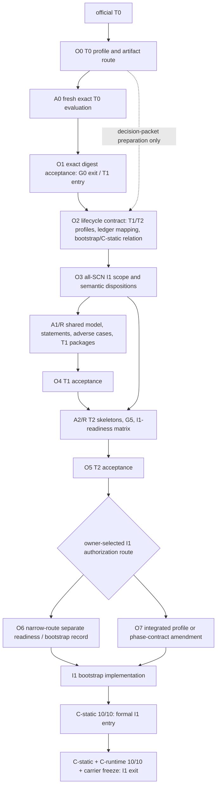

# Plan 197 - I1 bootstrap の判断・readiness 監査

## 役割と権限

これは Canon と現行 LAB 証拠を照合して作る **LAB repository memory** である。
規範正本は `mirrorea_canon/` であり、この文書は Gate / Phase / SCN / OBL /
proof status / Core / carrier / conformance / production implementation を変更しない。
特に、ここでいう推奨は owner disposition ではない。

Plan 196 は T0 から T2 までの条件付き研究計画である。本計画はそのうち
**I1 実装をいつ、何を根拠に始められるか** を深掘りする。Plan 196 の履歴を
書き換えず、I1 入口についてはより保守的な `narrow T2 + separate I1-readiness`
を LAB 推奨として採る。

## 結論

**現在の official I1 実装開始は認可されていない。** Canon の唯一の実装状態は
`T0` であり、T0--T2 では production implementation が凍結されている。
最初の停止要因は実装能力や Lean の不足ではなく、owner-reserved な lifecycle
contract である。

I1 を安全に開始するには、少なくとも次を分けて成立させる必要がある。

1. T0 profile と G0 exit を正規に処理し、official T1 entry に到達する。
2. T1/T2 の profile、proof/status の意味、T2 と I1 の関係を Canon で定義する。
3. all-SCN I1 が消費する Surface/Core/runtime の未決意味論を選び、選択後の
   shared model と反例検査を通す。
4. owner が narrow T2 route を選んだ場合は、T2 を閉じた後に別の I1-readiness
   profile で bootstrap の範囲、C-static の位置、all-SCN の意味、carrier baseline を
   owner が受理する。統合 route 又は phase-contract amendment も未選択の代替である。

ここで必要なのは **全定理の証明、最終 JSON ABI、実 transport、最終 viewer、
carrier field-name の凍結ではない**。それらは I1 exit 又は後段の仕事である。

## Canon から読める事実

| 事項 | Canon の現在の記述 | I1 への含意 |
| --- | --- | --- |
| current state | `plan/01-phases` は official `T0` を唯一の実装状態とする | LAB 実行証拠だけで I1 を開始できない |
| production moratorium | T0--T2 は implementation freeze。ADR-0014 は production merge を留保する | build authorization は owner / Canon action が必要 |
| conformance | `spec/06` は C-static 10/10 を `PHASE-I1 entry`、C-runtime 10/10 を `PHASE-I1 exit` とする | parser/checker/elaborator を作る前に C-static を要求する読み方は循環し得る |
| phase table | `plan/01-phases` の I1 exit は C-static + C-runtime 10/10 と carrier freeze | `spec/06` と entry/exit の配置を整合化する Canon action が必要 |
| conformance scope | frozen SCN-01..10 が定義そのもので、waiver は許されない | current all-SCN I1 は arbitrary subset ではなく十件を対象にする |
| phase profile | universal rule は JSON profile + human acceptance、具体化済みなのは T0 のみ | T1/T2 exit profile が必要。I1 authorization は owner-selected route で扱う未定義事項であり、narrow route なら separate readiness record が候補 |
| carrier | `arch/04` の field-name freeze は I1 exit。追加 field は可、削除・意味変更は不可 | 開始前に必要なのは semantic baseline であり final field-name ではない |

このため、`I1 を始める` をそのまま formal I1 entry と読むことは危険である。本計画では
以下の三つを明示的に分ける。

| 用語 | 意味 | 現在の状態 |
| --- | --- | --- |
| I1 bootstrap authorization | single-process `mir-parse/check/elab/run` を実装し始めてよいという、範囲付き production authorization | Canon に standalone record は未定義。owner が新たに定義・受理する必要がある |
| formal I1 entry | C-static 10/10 を満たした時点 | `spec/06` は entry と呼ぶが、開始前に満たすか I1 内の最初の milestone にするかは未整合 |
| I1 exit | C-static + C-runtime 10/10 と carrier freeze を満たした時点 | phase table の exit criterion。C-static の entry/exit 両記述は整合化が必要 |

## 判断と研究の依存関係

`O` は owner / Canon action、`A` は ADR-0014 の範囲での autonomous LAB package、
`R` は独立 review を表す。

`O0` から `O6` は必ずしも一つずつの ADR ではない。相互依存する項目を同じ
owner review に載せてもよいが、受理 record は artifact identity と非効果を個別に
追跡できなければならない。

## Owner 判断パケット

### O0 - T0 profile と artifact continuity

これは **いま最初に必要な判断** である。現行 v1 は `pass` と `derived-pass` の
矛盾を含み、既存 artifact はその source revision を自己 bind するため、後から
文言だけを直しても conforming artifact にはならない。

| 候補 | 内容 | 評価 |
| --- | --- | --- |
| A | `phase-governance/t0-g0` v2 を作り、success literal を `pass` に統一。v1 artifact は nonconforming historical evidence として保持し、v2 の fresh artifact を一回だけ許す | **推奨**。source-bound artifact と exact contract を両立し、G0-D3 を勝手に進めない |
| B | v1 の corrigendum だけで既存 artifact を継続利用する | 非推奨。旧 artifact が矛盾した blob を自己 bind する問題を解けない |
| C | 現状を defer する | 正当だが official T1 entry は開かない |

O0 の受理は G0 exit ではない。次の `A0` が exact Git blobs、順序、cardinality、
RFC 8785 digest、three checks、non-claims を検証し、その後に `O1` で owner が
exact digest を accept するか defer する。

### O0 outcome (2026-07-28)

The owner accepted the displayed O0 wording. Canon v2 was adopted and the sole
artifact was recorded at `plan/198`. Its three checks are `pass` / `fail` /
`pass`, deriving root `fail` because four fixed controls changed after the
historical cut. This is a valid evaluation, not a malformed artifact, but it
does not make an O1/G0-D3 acceptance available. Re-pinning controls or allowing
another artifact is a new owner/Canon decision outside O0.

### O2 - lifecycle / proof evidence / C-static の読み方

このパケットは profile を追加するため、owner-reserved である。少なくとも次を
一意化する。

| 問題 | 候補 | 推奨 |
| --- | --- | --- |
| T2 と I1 の関係 | `narrow T2` の後に I1-readiness profile を置く / T2 profile に I1-readiness を統合する | **narrow T2 + separate readiness**。現行 T2 の proof-skeleton/G5 意味を過積載せず、all-SCN implementation 条件を別 record で監査できる |
| bootstrap と formal entry | C-static を非-production prequalification にする / bootstrap を明示し C-static を I1 の最初の formal milestone とする / I1 exit table を含め phase/conformance 関係を別に改める | **範囲付き bootstrap を明示し、C-static 10/10 を formal I1 entry とする**。`spec/06` の entry 読みを保ちつつ、実装開始の循環を解く。ただし C-static は phase table の I1 exit evidence から除外しない。entry/exit の二重記述は通常の Canon process で整合化する |
| proof evidence | ledger status だけへ overload / profile-local evidence class と acceptance を定義し ledger は既存 status のままにする | **後者**。`statement`、`complete`、`proof skeleton` を勝手に `lean-proved` 等へ読み替えない |
| OBL-003/027 と G4/G6/G7 | 全てを T2 exit に暗黙要求 / I1-readiness profile で `pre-bootstrap`、`I1-time`、`later` を明示分類 | **明示分類**。all-SCN に消費される interface は省略できないが、最終 proof / ABI を前倒ししない |

### O3 - all-SCN I1 scope と意味論の選択

current I1 は SCN-01..10 の C-static/C-runtime 10/10 を対象とする。subset 化は
implementation convenience ではできず、Phase 又は conformance の Canon revision が
必要である。

| 境界 | 主な候補 | 推奨と根拠 |
| --- | --- | --- |
| I1 scope | current all-SCN / I1 を narrow fragment に変更 | **current all-SCN**。frozen conformance definition と no-waiver rule を維持する。狭めるなら別途 Canon amendment |
| Surface grammar | PROPOSAL-004 A Participant-only / B custom keyspace / C partial の維持 | **A**。現行 SCN と active LAB は `Participant` のみで、新 builtin や keyspace declaration を入れない |
| elaboration outcome | PROPOSAL-008 A separate totality / B OBL-021 内 / C contract 弱化 / D defer | **A**。existence と determinism を別の proof boundary にし、BND-001 を暗黙に弱めない |
| value and occurrence | PROPOSAL-012 の V/R/S/A | **V1/R1/SW1/conditional A2**。SCN-02 の read-dependent write、owner-serial mutation、admission lineage を明示できる。selection 後にも tuple compatibility review が必要 |
| validation context | PROPOSAL-013 M1 request-local claims / M2 explicit non-transport correlation / MD defer | **M1**。authoritative state と照合する claims を明示でき、transport identity や hidden side relation に寄らない。これは proposal 自身の順位ではなく audit の推論 |
| SCN-08 and OPEN-005 | scalar/terminal fallback を明示 closure / indexed state に読み替える / scenario を I1 から除外 | **scalar state と terminal/default declaration を明示 closure**。anchor は participant-specific life より長く生きる必要がある。SCN を変えるなら ADR が必要 |
| `return` | Core/elaboration rule を追加 / v0 exact fragment から明示除外 / partial のまま | **明示除外**。canonical SCN は必要とせず、control-flow semantics を先取りしない。ただし現在の Surface grammar から除外する Canon action と diagnostic policy を要する |

いずれの選択も、選択しただけで implementation-ready にはならない。`A1` では
V/R/S/A/M の composition、SCN-01..10 の positive/negative trace、failure no-mutation、
DAG、redaction、fallback lineage、cut/save/load の adverse cases を検証する。

### O4/O5 - T1/T2 acceptances

`A1` の shared model と Gate package は、selected Canon boundary を形式化・反証・
検証する自走範囲である。owner はその evidence cut に対し次を受理する。

- T1: G1--G3 の statement identities、SCN finalization、profile result、ledger の
  exact status/action。
- T2: OBL-020/021/002 の non-opaque skeleton、G5 の non-circular model、profile
  result、acceptance record。

G5 では saved-object validation predicate、restore relation、restored-state safety
property を分ける。`no stale resurrection` を success predicate に埋めて同じ性質を
導くことは evidence として認めない。

### O6 - narrow route を選んだ場合の separate I1-readiness / bootstrap authorization

O6 は owner が narrow T2 route を採った場合に、T2 を I1 authorization と混同しない
ための **提案された** record である。これは現在の Canon gate ではない。owner が
integrated profile 又は direct phase-contract amendment を採る場合は、その選択済み
record が以下と同等の情報を bind する。

separate route では、少なくとも次を bind する。

1. selected `.mir` fragment と frozen SCN-01..10 の positive/negative inputs。
2. deterministic single-process conformance profile、`profile_hash`、C-static と
   C-runtime の pass/fail report meaning。
3. parser / checker / elaborator / runtime に必要な statement-level semantics:
   elaboration outcome、residual obligation、request/failure、authority/visibility、
   fallback、patch、local cut/save/load、SCN-05/06 topology interpretation。
4. selected Gate/OBL evidence class。open の OBL を open のまま残す場合も、そのことと
   I1 で依存しない理由を明記する。
5. I1 carrier baseline、BND-001/002/004/005/006/008/009 の I1 scope、final freeze
   procedure。field-name freeze は I1 exit に残す。
6. named I1 bootstrap scope に限った production moratorium の解除。C-static 10/10、
   I1 exit、public completion を宣言しない。後の I1 exit では C-static の継続達成、
   C-runtime 10/10、carrier freeze を併せて確認する。

## 自走できる範囲

owner 判断前でも、ADR-0014 の standing predicate を個別に満たす既存 lane では、
literal transcription、countermodel、conditional lemma、existing-lane experiment、
bounded implementation validation を進められる。L3 pre-registration は anchor、
alternative/falsifier、non-effects、rollback を先に固定する。

ただし、次は自走で選べない。

- T0 profile correction、G0/T1/T2/I1 lifecycle、conformance classification、SCN。
- Core / authority / effect / failure / occurrence / carrier contract の意味選択。
- `theory/11` の wording、status、target、discharge。
- Canon integration、new helper/lane/schema/CI、production implementation merge。

L2 promotion は owner-authenticated trust anchor が未構成のため fail-closed だが、
L3 research と owner による直接 Canon adoption の妨げではない。

## 開始前に固定しないもの

- final carrier field names、public JSON / wire ABI、CLI name。
- real transport、production identity provider、distributed durability、performance
  optimization、browser View、final projection/codegen.
- theorem の最終 discharge、public product completion。

これらを先に固定しないことは scope 削減ではない。I1 の deterministic
single-process reference implementation が実際に消費する semantic interface と、
後段の replaceable implementation choice を分離するためである。

## 今回到達した停止線

最初に owner が判断すべき文は次である。

> `phase-governance/t0-g0` v2 を作り、success literal は `pass` のみとする。v1
> artifact は nonconforming historical evidence として保持し、v2 に対する fresh
> exact evaluation を一回だけ許可する。この判断は G0-D3 acceptance、G0 exit、
> T1 entry、I1 authorization を含まない。

これを受理した後は、fresh artifact の生成・独立検証・report・commit/push までを
自走できる。その後の exact digest acceptance が次の owner checkpoint である。

## 根拠

- Canon: `mirrorea_canon/plan/00-gates.md`, `plan/01-phases.md`,
  `plan/02-operating-model.md`, `spec/02-surface-grammar.md`,
  `spec/05-runtime-semantics.md`, `spec/06-conformance.md`,
  `architecture/02-boundary-contracts.md`, `architecture/04-runtime-carriers.md`,
  ADR-0013, ADR-0014, SCN-01..10, PROPOSAL-004/008/012/013.
- LAB: Plan 196、Plan 180、Plan 187、whole-theory foundation audit。
- Independent review: planner と reviewer の read-only audit、temporary GPT-5.6 Sol
  Pro Oracle consultation。いずれも advisory evidence であり、Canon を上書きしない。

## Non-claims

この文書は T0/G0/T1/T2/I1 の移動、OBL status/proof の変更、SCN expectation の変更、
C-static/C-runtime pass、production implementation、carrier freeze、public readiness を
主張しない。
